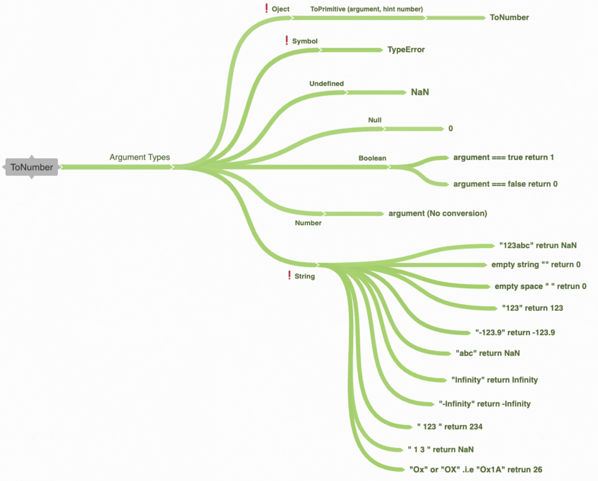
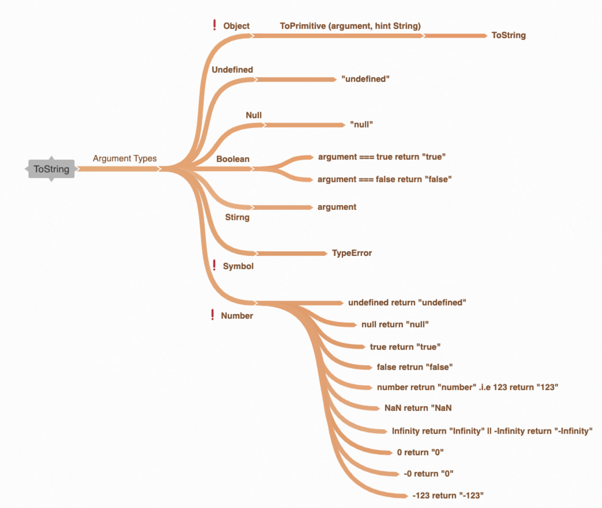
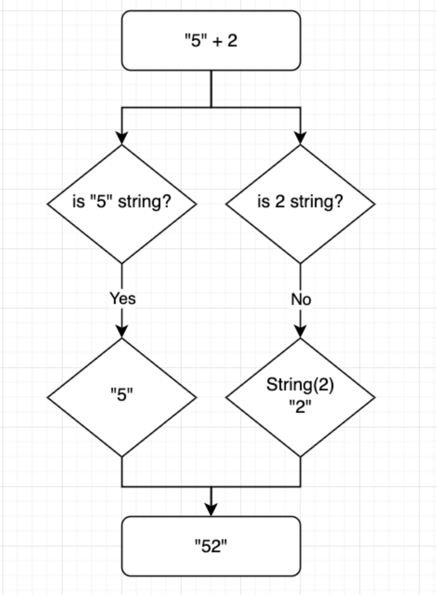
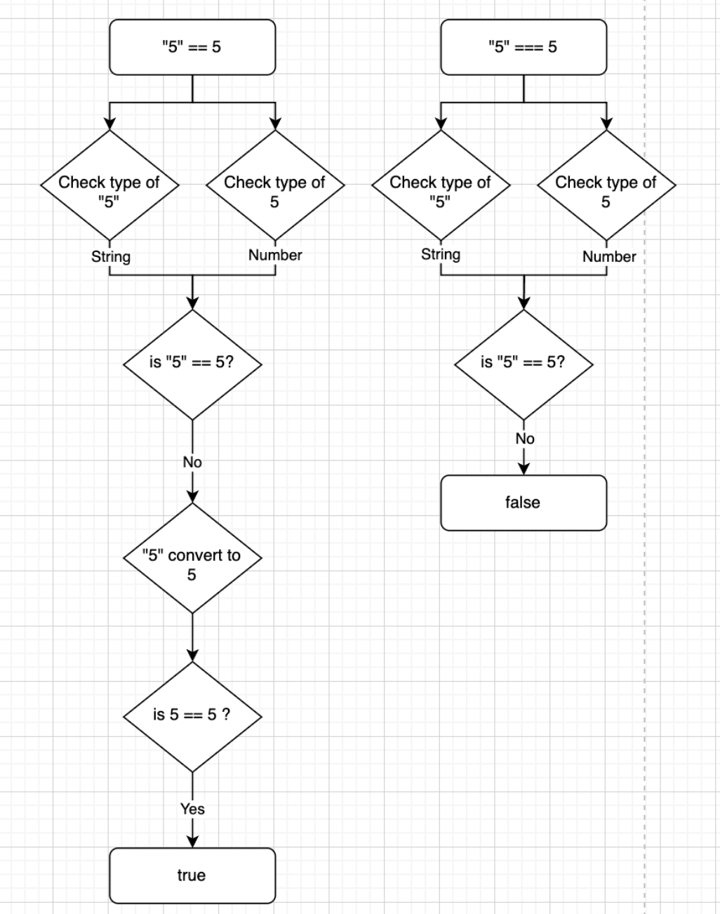
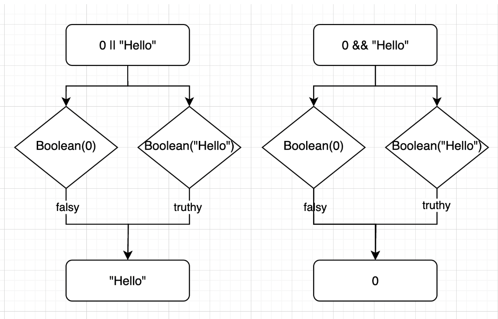
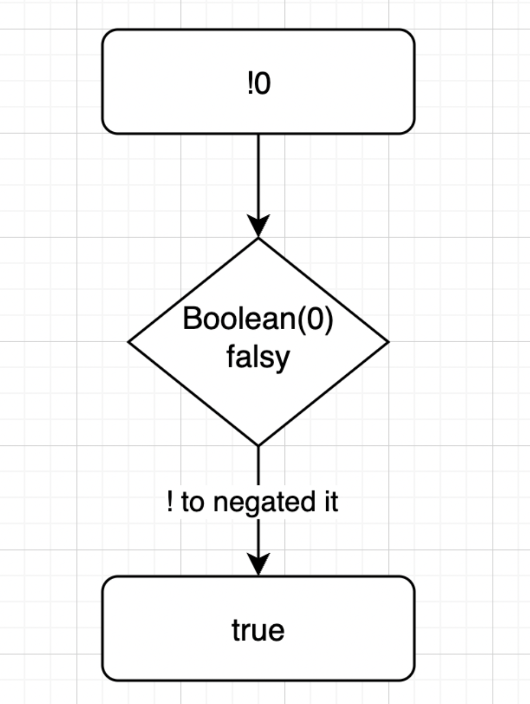

# Day 1: Type Conversion vs. Type Coercion


## Table of Contents

- [Type Conversion](#type-conversion)
- [Types of Conversion](#types-of-conversion)
  - [Explicit Conversion](#explicit-conversion)
    - [ToBoolean](#toboolean)
    - [ToNumber](#tonumber)
    - [ToString](#tostring)
  - [Implicit Conversion (Coercion)](#implicit-conversion-coercion)
    - [Operators](#operators)
      - [Addition](#addition)
      - [Other Arithmetic Operators](#other-arithmetic-operators)
      - [Logic](#logic)
      - [Logical OR and Logical AND](#logical-or-and-logical-and)
      - [Logical NOT](#logical-not)

The definition of type conversion in ECMAScript:

> The ECMAScript language implicitly performs automatic type conversion as needed. To clarify the semantics of certain constructs it is useful to define a set of conversion abstract operations. The conversion abstract operations are polymorphic; they can accept a value of any ECMAScript language type or of a Completion Record value. But no other specification types are used with these operations.

---

## Types of Conversion

- **Implicit conversion:** as known as type coercion: This is done automatically with the use of methods.
- **Explicit conversion:** This is done with using built-in methods or functions.

### Explicit Conversion

Below are common used methods and built-in functions.

- ToBoolean
  - Boolean()
    - !!
- ToNumber
  - Number()
  - parseInt()
  - parseFloat()
- ToString
  - String()
  - toString()

---

#### ToBoolean


```js
// Undefined
let a = undefined;
let bool = Boolean(a);
console.log(bool); // false

// Null
let a = null;
let bool = Boolean(a);
console.log(bool); // false

// boolean
let a = true;
let bool = Boolean(a);
console.log(bool); // true

// Number
let a = 0;
let bool = Boolean(a);
console.log(bool); // false

let a = -0;
let bool = Boolean(a);
console.log(a); // false

let a = NaN;
let bool = Boolean(a);
console.log(a); // false

let a = 1;
let bool = Boolean(a);
console.log(bool); // true

// String
let a = "";
let bool = Boolean(a);
console.log(bool); // false

let a = " ";
let bool = Boolean(a);
console.log(bool); // true

// object
let a = {};
let bool = Boolean(a); // true

// Symbol
let a = Symbol("Hello");
let bool = Boolean(a);
console.log(bool); // true
```

---

#### ToNumber



Convert to number is a bit complicated, especially when the argument is String and Symbol.

```js
// Undefined
let value = undefined;
let num = Number(value);
console.log(num); // NaN

// Null
let value = null;
let num = Number(value);
console.log(num); // 0

// Boolean
let value = false;
let num = Number(value);
console.log(num); // 0

let value = ture;
let num = Number(value);
console.log(num); // 1

// Number
let value = 23;
let num = Number(value);
console.log(num); // 23

// Symbol
let value = Symbol(23);
let num = Number(value);
console.log(num); // TypeError: Cannot convert a Symbol value to a number

// String
let valueWithEmptyString = "";
let num1 = Number(valueWithEmptyString);
console.log("valueWithEmptyString:", num1); // 0

let valueWithEmptySpace = " 123";
let num2 = Number(valueWithEmptySpace);
console.log("valueWithEmptySpace:", num2); // 123

let valueWithNumString = "123";
let num3 = Number(valueWithNumString);
console.log("valueWithNumString:", num3); // 123

let valueWithNumString2 = "123.456";
let num4 = Number(valueWithNumString2);
console.log("valueWithNumString2:", num4); // 123.456

let valueWithNumberStringAndChar = "123a";
let num5 = Number(valueWithNumberStringAndChar);
console.log("valueWithNumberStringAndChar:", num5); // NaN

let valueWithChar = "abc";
let num6 = Number(valueWithChar);
console.log("valueWithChar:", num6); // NaN

let valueWithInfinite = "Infinity";
let num7 = Number(valueWithInfinite);
console.log("valueWithInfinite:", num7); // Infinity

let valueWithNegaInfinite = "-Infinity";
let num8 = Number(valueWithNegaInfinite);
console.log("valueWithNegaInfinite:", num8); // -Infinity

let valueWithEmptySpacesBetweenChar = " 3 0 ";
let num9 = Number(valueWithEmptySpacesBetweenChar);
console.log("valueWithEmptySpacesBetweenChar:", num9); // NaN

let valueWithUniCode = "😀";
let num10 = Number(valueWithUniCode);
console.log("valueWithUniCode:", num10); // NaN

let valuewithUTF16 = "0x1A";
let num11 = Number(valuewithUTF16);
console.log("valuewithUTF16:", num11); // 26

// Object
let obj = {
  valueOf() {
    return 23;
  },
  toString() {
    return "Hello";
  },
};

const newObj = Number(Obj);
console.log(newObj); // 42

let obj = {
  toString() {
    return "Hello";
  },
};

const newObj = Number(Obj);
console.log(newObj); // NaN
```

---

#### ToString



```js
// Undefined
let valueUndefined = undefined;
let str1 = String(valueUndefined);
console.log("valueUndefined:", str1); // "undefined"

let valueNull = null;
let str2 = String(valueNull);
console.log("valueNull:", str2); // "null"

let valueOfTrue = true;
let str3 = String(valueOfTrue);
console.log("valueOfTrue:", str3); // "true"

let valueOfFalse = false;
let str4 = String(valueOfFalse);
console.log("valueOfFalse:", str4); // "false"

let valueOfNumber = 123;
let str5 = String(valueOfNumber);
console.log("valueOfNumber:", str5); // "123"

let valueOfNaN = NaN;
let str6 = String(valueOfNaN);
console.log("valueOfNaN:", str6); // "NaN"

let valueOfInfinity = Infinity;
let str7 = String(valueOfInfinity);
console.log("valueOfInfinity:", str7); // "Infinity"

let valueOfNegativeZero = -0;
let str8 = String(valueOfNegativeZero);
console.log("valueOfNegativeZero:", str8); // "0"

let valueOfZero = 0;
let str9 = String(valueOfZero);
console.log("valueOfZero:", str9); // "0"

let valueOfNegativeNum = -123;
let str10 = String(valueOfNegativeNum);
console.log("valueOfNegativeNum:", str10); // "-123"

// Symbol
let greeting = Symbol("Hello");
console.log(String(greeting)); // Symbol(Hello) => string

let greeting = Symbol("Hello") + "World";
console.log(String(greeting)); // TypeError: Cannot convert a Symbol value to a string
```

> ❗️Although 0 and -0 is different when the type is number, when converting to string, both of them are "0".

---

### Implicit Conversion (Coercion)

Type coercion typically occurs when two values of different types are used together in an operation.
Different operators will apply type conversion to operands in various ways to ensure that the operation can be performed.

#### Operators:

- Addition `(+)`
- Subtraction `(-)`
- Multiplication `(*)`
- Division `(/)`
- Percentage `(%)`

##### Addition

When one of the operands is a string, the other operand will be converted to a string, and string concatenation will be performed.

```js
let result_1 = "5" + 2;
console.log(result_1); // 52 => string

let result_2 = 2 + "5";
console.log(result_2); // 25
```

The conversion flow is like below:



##### Other Arithmetic Operators:

It forces converting a string to number.

```js
const result_1 = "5" - 2;
console.log(result_1); // 3

const result_2 = 2 - "5";
console.log(result_2); // -3

const result_3 = "6" * "2";
console.log(result_3); // 12

const result_4 = 12 / "6";
console.log(result_4); // 2;
```

##### Logic

When use loose equality, coercion is performed before comparison.
When use strict equality, type comparison comes first, if type is different, return falsy.

```js
// loose equality
console.log("5" == 5); // true;

// strict equality
console.log("5" === 5); // false
```

The flow is like below:



##### Logical OR and Logical AND

The operands are converted to boolean values for the logical operation.

```js
// OR(||)
console.log(0 || "hello"); // "hello"

// AND(&&)
console.log(0 && "hello"); // 0
```

The flow is like below:



> In JavaScript, both the `&&` (AND) and `||` (OR) logical operators use short-circuit evaluation. Here's a more detailed explanation:
>
> - OR (`||`) Operator: If the first argument evaluates to true, the overall result is true, and the second argument is not evaluated.
>
> - AND (`&&`) Operator: If the first argument evaluates to false, the overall result is false, and the second argument is not evaluated.

##### Logical NOT 

The operand is converted to a boolean value and then negated.

```js
console.log(!0); // true
```

The flow is like below:



---

## Type Conversion Questions ( Created by GPT )

1. Explain how to explicitly convert different types to strings, numbers, and booleans, and provide example code.

```js
let num = 123;
let strNum = String(num);
let strNum2 = num.toString();

let str = "456";
let numStr = Number(str);
let numStr2 = parseInt(str);

let bool = true;
let numBool = Number(bool);
let boolNum = Boolean(numBool);
```

2. Explain what implicit type conversion is and provide examples of when it occurs.

```js
console.log("5" - 2);
console.log("5" + 2);
console.log(1 + true);
console.log("5" * "2");
```

3. Explain the difference between `==` and `===`, and provide examples of when to use them.

```js
console.log("5" == 5);
console.log("5" === 5);

console.log(null == undefined);
console.log(null === undefined);
```

4. Explain why "0" == false results in true, while "0" === false results in false.

```js
console.log("0" == false);
console.log("0" === false);
```

5. Explain what happens during arithmetic operations when numbers and strings are mixed, and provide examples.

```js
console.log("5" + 2);
console.log("5" - 2);
console.log("5" * 2);
console.log("5" / 2);
```

6. Explain which values are converted to false and which are converted to true in conditional statements.

```js
if (0) {
  console.log("This won't be logged");
} else {
  console.log("0 is falsy");
}

if ("") {
  console.log("This won't be logged");
} else {
  console.log('"" is falsy');
}

if (1) {
  console.log("1 is truthy");
}

if ("hello") {
  console.log('"hello" is truthy');
}
```

---

## References:

- [Equality comparisons and sameness](https://developer.mozilla.org/en-US/docs/Web/JavaScript/Equality_comparisons_and_sameness)
- [ECMAScript - Type Conversion](https://tc39.es/ecma262/#sec-type-conversion)
