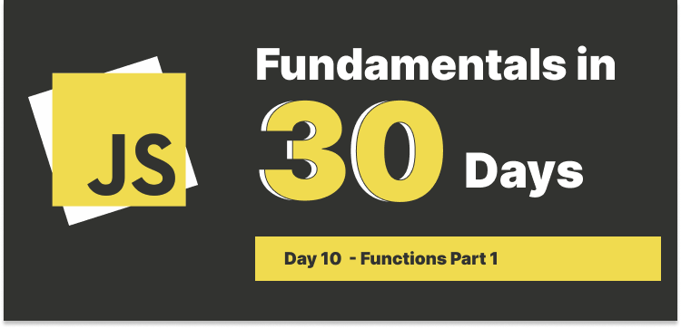

# Day 10 : Functions part 1 (General Overview)



## Table of Contents

### What is a function?

In computer science, a function is a **callable unit** of software logic that has a **interface** and **behavior** and can be invoked multiple times.

In JavaScript, a function is a **first-class objects**, wait...object? Yes, functions are instances of the `Function` object in JavaScript.

```javascript
function myFunction() {}
console.log(typeof myFunction.prototype); // object
```

#### Fist-class functions (First-class citizens)

If a programming language supports first-class functions, it means that it typically can be:

1. Assigned to a variable.
2. Passed as an argument to a function.
3. Returned from a function.

Let's see an example:

```javascript
// 1. Assigned to a variable

const greeting = () {
  console.log('Hello, World!');
}

// 2. Passed as an argument to a function
const greeting = (name) {
  console.log(`Hello, ${name}!`);
}

// 3. Returned from a function
const greeting = () {
  return 'Hello, World!';
}
```

---

### Two ways to define a function

We can define a function in two ways:

1. Function declaration
2. Function expression

#### Function declaration

The keyword `function` goes first, followed by the name of the function, a list of parameters in parentheses, and the function body in curly braces, then we can call the function by its name with parentheses.

```javascript
function greeting() {
  console.log("Hello, World!");
}

// Invoke the function
greeting();
```

#### Function expression

Whenever you see a equal sign `=` after the function keyword or in es6, the arrow function `=>`, it's also a function expression.

```javascript
const greeting = function () {
  console.log("Hello, World!");
};

// Arrow function
const greeting = () => {
  console.log("Hello, World!");
};
```

### Main differences between function declaration and function expression

Let's review a very important concept - **Execution Context**, a execution context is created when JavaScript engine runs our code, when it runs, it creates a **global execution context**, imagine global execution context is a huge hidden map, and JavaScript will draw(store) all the variables declare with `var` and functions in the map.

In this phase, only function declarations are being stored in the map, not function expressions, but why?

When JavaScript runs the engine, variables declare with `var` are `undefined` in the creation phase, but variables declare with `let` and `const` are in the `temporal dead zone (TDZ)`, it would show `ReferenceError` if we try to access them.

Let's see some examples:

```javascript
// Declare variables with var and let
console.log(helloWithVar); // undefined
console.log(helloWithLet); // ReferenceError

var helloWithVar = "Hello, World!";
let helloWithLet = "Hello, World!";
```

```javascript
// functions

console.log(greetingDeclaration); // [Function: greetingDeclaration]
console.log(greetingExpression); // ReferenceError

function greetingDeclaration() {
  console.log("Hello, World!");
}

const greetingExpression = function () {
  console.log("Hello, World!");
};
```

Let's invoke the functions:

```javascript
console.log(greetingDeclaration()); // Hello, World!
console.log(greetingExpression()); // ReferenceError

function greetingDeclaration() {
  console.log("Hello, World!");
}

const greetingExpression = function () {
  console.log("Hello, World!");
};
```

The terms `hoisting` happened when using **function declarations**, because in global memory, it already has the function declaration stored in the creation phase, that's why when in the execution phase, it can be invoked, on the other hand, function expression (functions assigned to variables with `let` or `const`) are not stored in the global memory in the creation phase, they are being held in the temporal dead zone (TDZ), that's why we can't access them before they are declared.

#### What if we use `var` to declare a function?

```javascript
console.log(greetingVar); // undefined

var greetingVar = function () {
  console.log("Hello, World!");
};
```

Let's invoke the function:

```javascript
console.log(greetingVar()); // TypeError: greetingVar is not a function

var greetingVar = function () {
  console.log("Hello, World!");
};
```

As you may notice that result of `greetingVar` is `undefined`, and when we try to invoke the function, it shows `TypeError`, because the function is not being stored in the global memory in the creation phase, it's just a variable with `undefined` value.

---

### Function Scope

When we declare a function, everything inside the function is being protected by the function scope, in other words, if we try to access variables outside the function, it will show `ReferenceError`,but with variables declared outside the function(global scope), function can access them because of the scope chain.

Function will first look at the variable within the function scope, if can't find it, it will look at the outer scope until it reaches the global scope.

```javascript
// Access variables declared outside the function
const greeting = function () {
  const message = "Hello, World!";
  console.log(message);
};

console.log(message); // ReferenceError
```

```javascript
// Access variables declared outside the function
const message = "Hello, World!";

const greeting = function () {
  console.log(message);
};
```
