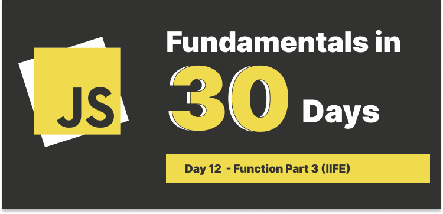
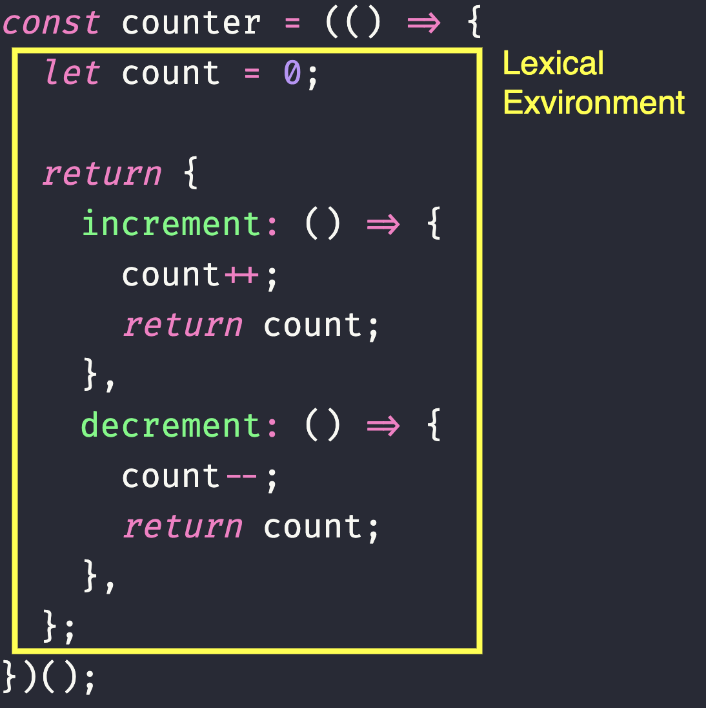

# Day 12 : Functions Part 3 (IIFE)



## Table of Contents

- [What is IIFE?](#what-is-iife)
- [Several ways to write IIFE](#several-ways-to-write-iife)
- [Use Cases of IIFE](#use-cases-of-iife)
  - [Does not pollute the global scope](#does-not-pollute-the-global-scope)
  - [Create private variables and closures](#create-private-variables-and-closures)
  - [Module Pattern](#module-pattern)

### What is IIFE?

IIFE (pronouns as "iffy") refers to **Immediately Invoked Function Expression**, it's a function that runs as soon as it's defined.

It is also called a **Self-Executing Anonymous Function**, it contains two major parts:

1. The first is the anonymous function with lexical scope enclosed within the `Grouping Operator ()`. This prevents accessing variables within the IIFE idiom as well as polluting the global scope.
2. The second part creates the immediately invoked `function expression ()` through which the JavaScript engine will directly interpret the function.

Consider the code snippet below and let's break it down:

```javascript
(function () {
  console.log("This function is executed immediately!");
})();
```

- The anonymous function is defined and wrapped within the `Grouping Operator ()`.
- The `()` at the end of the function definition calls the function immediately.


#### Several ways to write IIFE

- Using arrow function.

```javascript
(() => {
  console.log("This function is executed immediately!");
})();
```

- Using keyword `function`.

```javascript
(function () {
  console.log("This function is executed immediately!");
})();
```

- Using `!` operator.

```javascript
!(function () {
  console.log("This function is executed immediately!");
})();
```

This writing style is primarily used to ensure that the function is treated as an expression rather than a declaration, you might have seen people using `!`, `+`, `-`, `~` operators to achieve the same result, but this is not recommended because it can be confusing and not intuitive.

---

### Use Cases of IIFE

#### Does not pollute the global scope

In normal situation or building a relatively small project, it is okay to declare variables in the global scope, but when working on a large project, it could cause problems like name collision, overwriting variables, and so on.

IIFE helps to prevent this by creating a private scope for the variables declared within it and when the function is executed, the variables are destroyed.

```javascript
// Not using IIFE

const name = "John";

function sayHello() {
  console.log(`Hello, ${name}`);
}

// Using IIFE
(() => {
  const name = "John";
  const sayHello = () => {
    console.log(`Hello, ${name}`);
  };
  console.log("Inside IIFE", name);
  sayHello();
})();
```

In second example, IIFE will be executed immediately once the script is loaded and the variables declared within it will be destroyed after the function is executed, so if we try to invoke the `sayHello` function and `name` variable outside the IIFE, it will throw an error, see the code below:

```javascript
(() => {
  const name = "John";
  const sayHello = () => {
    console.log(`Hello, ${name}`);
  };
  console.log("Inside IIFE", name); // Output: John
  sayHello(); // Output: Hello, John
})();

console.log("Outside IIFE", name); // Error
sayHello(); // Error
```

#### Create private variables and closures

Let's review the definition of closure:

> A closure is the combination of a function bundled together (enclosed) with references to its surrounding state (the lexical environment). In other words, a closure gives you access to an outer function’s scope from an inner function. - MDN Web Docs

Let's see the following code:

```javascript
const counter = (() => {
  let count = 0;
  const increment = () => {
    count++;
    return count;
  };
  const decrement = () => {
    count--;
    return count;
  };
  return {
    increment,
    decrement,
  };
})();

console.log(counter.increment()); // Output: 1
console.log(counter.decrement()); // Output: 0
console.log(count); // Error
```

Let's break down the code above:

We declare a function expression called `counter`, inside the function, we declare a variable called `count`, and return an object with two methods, `increment` and `decrement`.

When we invoke the `counter.increment()` method, it increments the `count` variable by 1, and when we invoke the `counter.decrement()` method, it decrements the `count` variable by 1.

Why can we access the `count` variable? Think about when we execute `counter` function, we sort of create a shield from `counter` to the last curly brace, we can't access `count` outside the function because the scope, but when we try to access the `increment` and `decrement` methods, these two methods have access to the `count` variable because they are within the same shield.

Inside `increment`, it tried to look for `count` variable, it couldn't find it in its scope, so it went up to the parent scope which is the `counter` function and found the `count` variable and plus 1 to it, same process for `decrement` method.



#### Module Pattern

We can encapsulate our code using IIFE to create a module pattern, this is a design pattern used for creating a set of related methods and variables, together with the principle of information hiding, encapsulation, and organization.

For example, we might have seen something like this:

```javascript
const add = (x, y) => {
  const result = x + y;
  return result;
};

const subtract = (x, y) => {
  const result = x - y;
  return result;
};

const multiply = (x, y) => {
  const result = x * y;
  return result;
};

export { add, subtract, multiply };
```

But we can refactor the code above using IIFE to create a module pattern like this:

```javascript
const CalculateMath = (() => {
  return {
    add: (x, y) => {
      const result = x + y;
      return result;
    },
    subtract: (x, y) => {
      const result = x - y;
      return result;
    },
    multiply: (x, y) => {
      const result = x * y;
      return result;
    },
  };
})();

export default CalculateMath;
```

And we can use it like this:

```javascript
import CalculateMath from "./CalculateMath.js";

console.log(CalculateMath.add(2, 3)); // Output: 5
console.log(CalculateMath.subtract(5, 3)); // Output: 2
console.log(CalculateMath.multiply(2, 3)); // Output: 6
```
