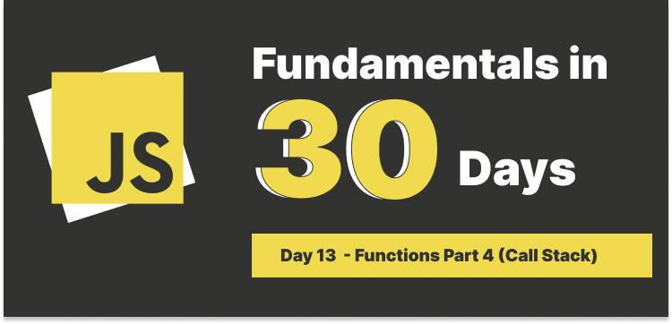
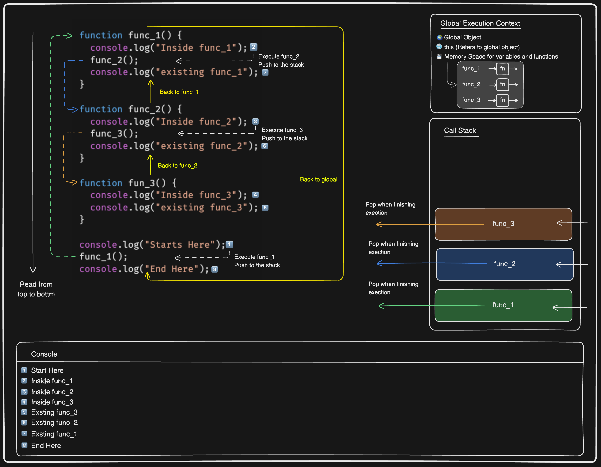

# Day 12 : Functions Part 4 (Call Stack)



## Table of Contents

### What is stack?

Stack is a data structure that follows the role of **Last In, First Out (LIFO)**. It means that the last element added to the stack will be the first one to be removed.

Think of a stack of a pile of books, the last book you put on the stack will be the first one you take off.

In JavaScript, the stack is used to keep track of function calls. When a function is called, it is added to the top of the stack. When the function returns, it is removed from the stack.

### The first call stack in JavaScript

When we execute a script, JS engine creates a **global context**, also indicated by **main()** or **global()** and pushes it on the top of the call stack. Then if there're other functions to be executed, they will be pushed on the top of the stack, when we talk about `main()` or `global()`, we often refer to the global execution context, it contains:

- Global Object (`window` in the browser, `global` in Node.js), this is why we can access these objects without declaring them, for example, `console.log()`, `setTimeout()`, `Math`, `window.location`, etc.
- All the functions and variables declared in the global scope.
- `this` keyword, which refers to the global object.

What about a nested function? Let's say we have 2 layers of functions, is this going to be 2 stacks or 1 stack?

> JavaScript Call Stack is a single-threaded, synchronous execution model, we can have different execution contexts based on the scope, but we only have 1 stack to keep track of all the function calls.

Let's see an example:

```javascript
function func_1() {
  console.log("Inside func_1");
  func_2();
  console.log("existing func_1");
}

function func_2() {
  console.log("Inside func_2");
  func_3();
  console.log("existing func_2");
}

function fun_3() {
  console.log("Inside func_3");
  console.log("existing func_3");
}

console.log("Starts Here");
func_1();
console.log("End Here");
```

Let's walk through the code:

1. JavaScript is a single thread language, it reads code from the top to the bottom, the engine creates a global execution context to store all the function in the memory.
2. The first execution is the `console.log('Starts Here')`, it is a **Web API**, so the first thing we've got it the string of `Starts Here`
3. The second line `func_1()`, it is a function call, so the engine will push the `func_1` on the top of the stack, this would be the first stack.
4. When we execute the `func_1()`, everything is going to inside this functional execution context, it will execute the `console.log("Inside func_1")`, then it will call the `func_2()`, so the `func_2()` will be pushed on the top of the stack.
5. The `func_2()` will execute the `console.log("Inside func_2")`, then it will call the `func_3()`, so the `func_3()` will be pushed on the top of the stack.
6. The `func_3()` will execute the `console.log("Inside func_3")`, then it will return to the `func_2()`, so the `func_3()` will be removed from the stack.
7. The `func_2()` will execute the `console.log("existing func_2")`, then it will return to the `func_1()`, so the `func_2()` will be removed from the stack.
8. The `func_1()` will execute the `console.log("existing func_1")`, then it will return to the global execution context, so the `func_1()` will be removed from the stack.
9. The last line `console.log("End Here")`, it is a **Web API**, so the last thing we've got it the string of `End Here`.

So the result would be:

```
Starts Here
Inside func_1
Inside func_2
Inside func_3
existing func_3
existing func_2
existing func_1
End Here
```

Hard to read? No worries, let's see this diagram:



---

### Stack Overflow

The stack has a limited size, if we have too many function calls, it will cause a **stack overflow** error, for instance, you have a recursive function that doesn't have a base case, it will keep calling itself until the stack is full.

```javascript
function callMyself() {
  callMyself();
}
```

If you run this code, you will get a **RangeError: Maximum call stack size exceeded**. If you have used `react` for a while, you might have seen this error before, it happens when using `useEffect` without a dependency array, it will cause an infinite loop.

---

### Tools that can help you to debug the call stack

- **Chrome DevTools**: You can use the `Sources` tab to debug the call stack, you can set breakpoints, step through the code, and see the call stack.
- [jsv900](https://www.jsv9000.app/)
- [loupe](http://latentflip.com/loupe/?code=JC5vbignYnV0dG9uJywgJ2NsaWNrJywgZnVuY3Rpb24gb25DbGljaygpIHsKICAgIHNldFRpbWVvdXQoZnVuY3Rpb24gdGltZXIoKSB7CiAgICAgICAgY29uc29sZS5sb2coJ1lvdSBjbGlja2VkIHRoZSBidXR0b24hJyk7ICAgIAogICAgfSwgMjAwMCk7Cn0pOwoKY29uc29sZS5sb2coIkhpISIpOwoKc2V0VGltZW91dChmdW5jdGlvbiB0aW1lb3V0KCkgewogICAgY29uc29sZS5sb2coIkNsaWNrIHRoZSBidXR0b24hIik7Cn0sIDUwMDApOwoKY29uc29sZS5sb2coIldlbGNvbWUgdG8gbG91cGUuIik7!!!PGJ1dHRvbj5DbGljayBtZSE8L2J1dHRvbj4%3D)
