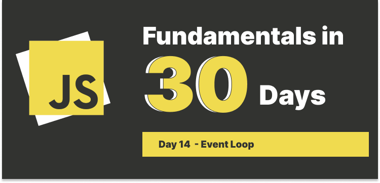
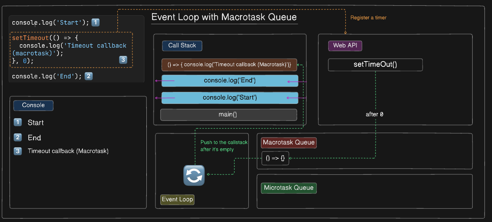
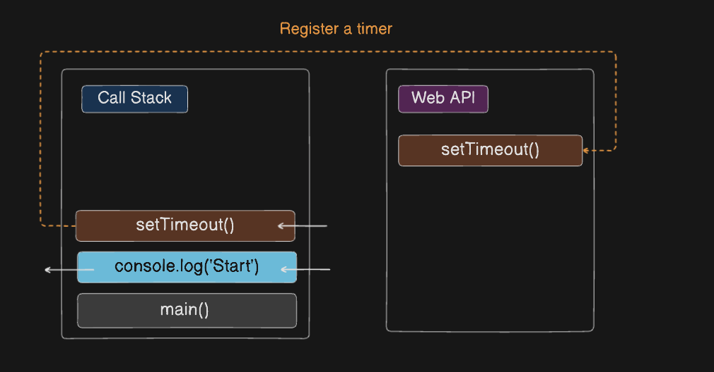
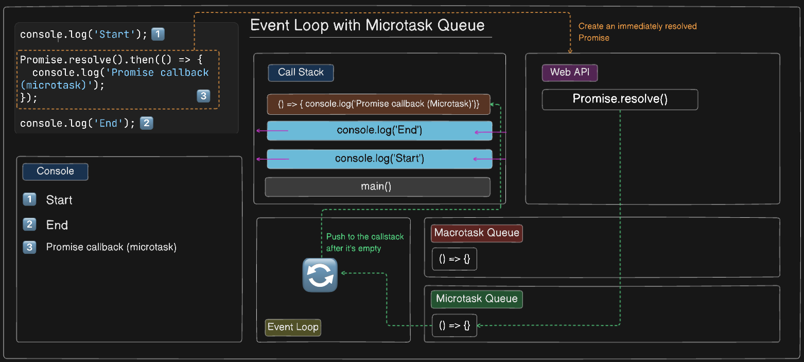

# Day 14: Event Loop

## Table of Contents

- [What is Event Loop?](#what-is-event-loop)
  - [JavaScript Runtime Model](#javascript-runtime-model)
- [How does Event Loop work?](#how-does-event-loop-work)
- [Conclusion](#conclusion)

### What is Event Loop?

Before we jump into what is Event Loop, let's review some of the basic, but important concepts in JavaScript.

JavaScript is a **single-thread** language, it means JavaScript can do one thing at a time, It can't do multiple things at the same time.

But sometimes we need to do multiple things at the same time, for example when we make an API call, we don't want to wait for the response, we want to continue executing the code, and when the response is ready, we want to handle it. This is where the Event Loop comes into play.

#### JavaScript Runtime Model

JavaScript runtime model consists of the following components:

- **Call Stack**:

  - Single-threaded execution of code.
  - Keeps track of function calls.
  - Last In First Out (LIFO) data structure.

- **Heap**:

  - Unstructured memory allocation.
  - Where Object are stored.

- **Queue**:

  - **Microtask Queue**:
    - Has higher priority than the macrotask queue.
    - Handles promises, mutation observer, for example `Promise.then()`.
  - **Macrotask Queue or Task queue or Callback Queue** (I'll use Macrotask queue as it's more precise):
    - Handles events, setTimeout, setInterval, I/O operations, for example `setTimeout()`, `setInterval()`, `fetch()`, `DOM events`.

- **Event Loop**:

  - Continuously checks if the call stack is empty.
  - Moves callback from the event queue to the call stack when it's empty.

- **Web APIs (in browsers)** or **Node APIs (in Node.js)**:
  - Provides additional functionalities.
  - Handle asynchronous operations.

### How does Event Loop work?

The Event Loop is a mechanism that makes JavaScript non-blocking. It allows JavaScript to perform multiple tasks without waiting for the completion of each task, think of it as a task scheduler, it schedules tasks to be executed in the future.

Essentially, the Event Loop continuously checks if the call stack is empty, then it will check if there's a task in the microtask queue, if there is, it will move the task to the call stack, if not, it will check the macrotask queue, if there's a task in the macrotask queue, it will move the task to the call stack.

Let's take a diagram to understand how the Event Loop works and how it handles the macrotasks.

1. JavaScript runtime starts reading the code, and create a global execution context, and push it to the call stack, in this stage, think of `main()` is a function that is being executed.

2. The first line of code is `console.log('Start')`, this will be pushed to the call stack, and it will be executed immediately, one it's done, it will be popped out of the call stack.
3. The second line of code is a `setTimeOut()`, it will be pushed to the call stack as well, but then it will be moved to the Web APIs, and registered a timer.
   
4. The last time of code is `console.log('End')`, same as the first line, it will be pushed to the call stack, and it will be executed immediately, one it's done, it will be popped out of the call stack.
5. After 0 seconds, the timer is done, the callback function of the `setTimeout()` will be moved to the macrotask queue.
6. The Event Loop will check if the call stack is empty, then it will check the macrotask queue, if there's a task in the macrotask queue, it will move the task to the call stack.

This is a diagram to show how the Event Loop works and how it handles the microtasks.

When there're microtasks and macrotasks, the Event Loop will always handle the microtasks first, then it will handle the macrotasks.

### Conclusion

- JavaScript is a single-threaded language, it can do one thing at a time, but thanks to the Event Loop, it can handle multiple tasks without waiting for the completion of each task.
- There're two types of tasks, microtasks and macrotasks, the Event Loop will always handle the microtasks first, then it will handle the macrotasks.

  - Microtasks: promises, mutation observer, for example `Promise.then()`.
  - Macrotasks: events, setTimeout, setInterval, I/O operations, for example `setTimeout()`, `setInterval()`, `fetch()`, `DOM events`.

- The Event Loop continuously checks if the call stack is empty, then it will check if there's a task in the microtask queue, if there is, it will move the task to the call stack, if not, it will check the macrotask queue, if there's a task in the macrotask queue, it will move the task to the call stack.
