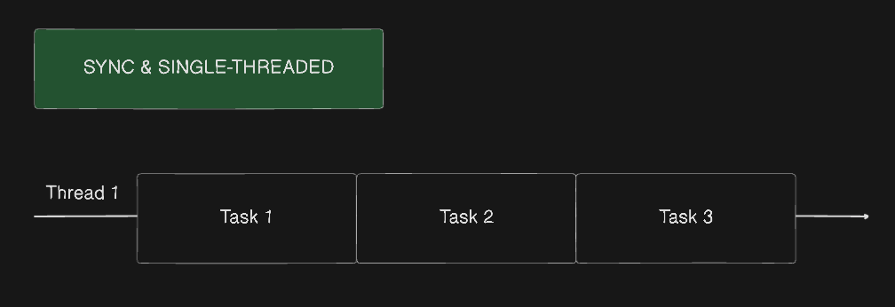

# Day 15: Promise


## Table of Contents

### Asynchronous vs. Synchronous Programming

Before we jump into the topic of Promise, let's first understand some of the important concepts of async, sync programming and single-threaded and multi-threaded programming.

#### Asynchronous Programming

Operations can be initiated without waiting for previous operations to complete. This allows for non-blocking execution.

#### Synchronous Programming

Operations are executed **sequentially**, one after another. Each operation must complete before the next one starts.

---

### Single-threaded vs. Multi-threaded Programming

In CS, a **thread** of execution is the smallest sequence of programming instructions that can be managed independently by a scheduler, which is typically a part of the operating system.

#### Single-threaded

It is the processing of one command of at a time.

#### Multi-threaded

Multithreading's execution model that allows multiple threads to exist within the context of one process. It can also be applied to one process to enable parallel execution on a multiprocessing system.

#### Single-threaded in Sync Programming model

In a single-threaded environment, a thread is assigned to one task and starts working on it. Once the task completes then it it available to take up the next task.



#### Multi-threaded in Sync Programming model

Have multiple threads which can take up tasks and working on it. This means that we have a pool of threads and tasks, but each thread can only work on one task at a time.


#### Single-threaded in Async Programming model

We know that when we use single-threaded in sync programming model, the task is executed one after another, in other words, the tasks need to be completed in order, but in async programming model, the tasks are interleaved to each other like the following diagram.


#### Multi-threaded in Async Programming model

Tasks are interleaved as well, you can start a task in thread 1 and complete it in thread 2, so on and so forth.


> Reference: [single-threaded-multi-threaded](https://codewala.net/2015/07/29/concurrency-vs-multi-threading-vs-asynchronous-programming-explained/)

---

### Async JavaScript

We have mentioned that JavaScript is a single-threaded language, it means that it can only execute one task at a time, but if you remember the Day 14, we have mentioned a crucial concept - **Event Loop**, let's review it.

#### Event Loop

Event loop is a mechanism that allows JavaScript to handle asynchronous events by offloading tasks to the browser's Web APIs and executing them in the background.

Imagine that there are three bookers, one is to track every task, we called it `Call Stack`, one is to track tasks that are related to Web APIs, specifically `setTimeout`, `setInterval` or `I/O`, etc, we called it `Macrotask Queue`, sometimes we call it `Task Queue` or `Callback Queue`, the last one is to track tasks that are related to `Promise`, `then`, `catch`, `finally`, etc, we called it `Microtask Queue`.

When the function is called, it will be pushed to the `Call Stack`, when the function is executed, it will be popped from the `Call Stack`, simple as that, but when the function is related to Web APIs, it will be pushed to the `Call Stack` first then pushed into `Web API`, then move to `Macrotask Queue` or `Microtask Queue`.

`Event Loop`is the coordinator that will check if the`Call Stack`is empty, if it's empty then it will make sure that the`Microtask Queue`is executed before the`Macrotask Queue`.

---

### Promise

Promise is a built-in object in JavaScript, it represents the eventual completion (or failure) of an asynchronous operation and its resulting value.

It will return an object that has three states: `pending`, `fulfilled`, and `rejected`.

- `pending`: Initial state, neither fulfilled nor rejected.
- `fulfilled`: The operation was completed successfully.
- `rejected`: The operation failed.

You may head of `resolved`, `resolved` means that the promise is settled or "locked-in" to match the eventual state of the promise, as it can be either `fulfilled` or `rejected`.

#### Chaining

You must have read or heard about a term - `Callback Hell`, it is a term that describes the situation where we have multiple callbacks that are nested inside each other, it is hard to read and maintain, like image below.


#### then, catch, finally

In order to avoid the `Callback Hell`, we can use `then` to handle the result of the Promise.

```javascript
// Not using arrow function
doSomething()
  .then(function (result) {
    return doSomethingElse(result);
  })
  .then(function (result) {
    return doSomethingElse(result);
  });

// Using arrow function
doSomething()
  .then((result) => doSomethingElse(result))
  .then((result) => doSomethingElse(result));
```

Usually we use `then` to handle the result of the Promise, but if the Promise is rejected, we can use `catch` to handle the error, `finally` is used to handle the result of the Promise, whether it is fulfilled or rejected.

```javascript
doSomething()
  .then((result) => doSomethingElse(result))
  .then((result) => doSomethingElse(result))
  .catch((error) => console.error(error));
```

---

### Promise concurrency

#### what is concurrency?

Concurrency means processing multiple requests out of order or simultaneously, without affecting the final outcome, it's about dealing with things at once, but not necessarily doing them at the same time.

- Simultaneous vs. Interleaved Execution: Concurrency does not necessarily mean things happen at the exact same moment, it can switching between tasks.
- Parallelism vs. Concurrency: Parallelism is about doing multiple things at the same time, while concurrency is about dealing multiple things at once.


#### Promise.all()

This will handel multiple promises at once, it will return a single promise that resolves when all of **the promises in the array** have resolved, and it will reject if any of the promises in the array reject.

```javascript
Promise.all([promise1, promise2, promise3])
  .then((values) => {
    console.log(values);
  })
  .catch((error) => {
    console.error(error);
  });
```

#### Promise.allSettled()

Can be used when need to handle multiple promises at once, but don't care about the result of the promises.

#### Promise.race()

Settles when any of the promises settles, fulfills when any of the promises fulfilled; rejected when any of the promises rejected.

#### Promise.any()

Fulfilled when any of the promises fulfilled; rejected when any of the promises rejected.

Methods above take an iterable of promises and return a new promise.

---

### async and await

Basically `async` and `await` are syntactic sugar for `Promise`, it is more readable and easier to use.

Let's compare the following code using `Promise` and `async` and `await`.

```javascript
// Using promise

const fetchData = () => {
  fetch("some.api.com")
    .then((res) => res.json())
    .then((data) => {
      console.log(data);
    });
    .catch((error) => {
      console.error("Error", error)
    })
}
```

```javascript
// Using async await
const fetchData = async () => {
  try {
    const res = await fetch("some.api.com");
    const data = await res.json();
    console.log(data);
  } catch (error) {
    console.error("Error", error);
  }
};
```
