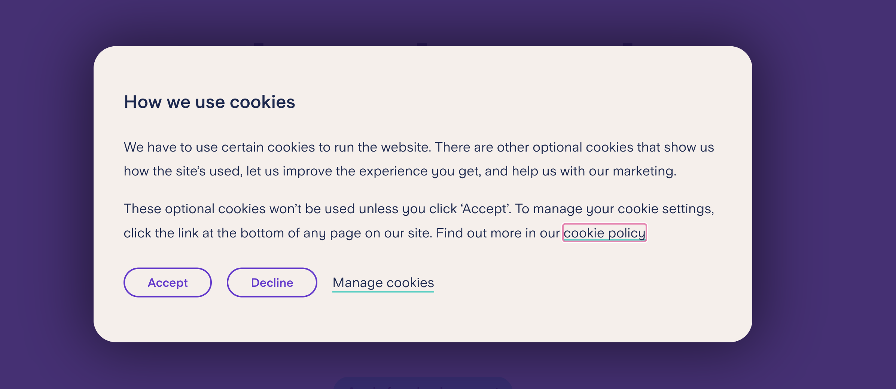

# Day 16: Storage


## Table of Contents

### CLient-Side Storage vs. Server-Side Storage

When we talk about "client-side", it it often referred to the browser, therefore, **client-side storage** means to store data on the browser. On the other hand, **server-side storage** means to store data on the server.

#### Why do we need to store data on the client side?

You may sometimes see some personalized content on a website, such as your name, your preferences, etc. This is because the website stores some data on your browser. This is useful because:

- It can improve the user experience by providing personalized content.
- It can reduce the load on the server by storing some data on the client side.

There are several ways to store data on the client side:

- Cookies
- Web Storage
- IndexedDB

Let's take a look at each of them.

---

### Storage quotas

In order to reduce the risk of users being tracked across websites, browser stores data per **origin (combination of protocol, host, and port)** in the most cases.

Data for an origin can be stored in two ways:

- Best-effort: Default way of storing data for an origin.
- Persistent: An origin can be opt-in to store data persistently.

But how much data can be stored?

- Cookies: Depends on the browsers and disk space.
- Web Storage (localStorage and sessionStorage): Limited to 10 MiB of data maximum on all browsers.Browsers can store up to 5 MiB of local storage, and 5 MiB of session storage per origin.

#### What happens when the storage limit is reached?

Browser will throw a `QuotaExceededError` exception, so we can implement a try-catch block to handle this exception or to use the `navigator.storage.estimate()` to check how much storage is available.

Now that's take a look at each of the storage methods.

---

### Cookies

When you visit a website, most of them will ask something like "Do you accept cookies?" like image below:



Cookies is a old way of storing data on the client side, and it is often related to personal privacy. It stores a small amount of data on the browser, we can create new cookies, read cookies, and delete cookies or modify them.

For example, when you sing in (send credentials) to a website, the website will create a cookie to store your session information. This is how the website knows you are logged in, even if you refresh the page or visit another page.

#### Main uses of cookies:

- Session management
- Personalization
- Tracking

#### Why it is an old way of storing data?

Because cookies need to be sent to the server with every request, which can slow down the website. Also, cookies have a limit of 4KB, which is not enough for storing large data.

---

### Web Storage

It is a new way of storing data on the client side, it can store a key-value pair in the browser. There are two types of Web Storage:

- Local Storage
- Session Storage

#### Local Storage

It persists even when the browser is closed and reopened, it has no expiration date, and it is stored across browser sessions.

#### Session Storage

On the other hand, Session Storage is available only for the duration of the page session. It is deleted when the page session ends.

Here is how we can use Local Storage:

```javascript
// Set data to local storage

localStorage.setItem("name", "John Doe");

// Get data from local storage

const name = localStorage.getItem("name");

// Remove data from local storage

localStorage.removeItem("name");

// Modify data from local storage

localStorage.setItem("name", "Jane Doe");

// Clear all data from local storage

localStorage.clear();
```

Here is how we can use Session Storage:

```javascript
// Set data to session storage

sessionStorage.setItem("name", "John Doe");

// Get data from session storage

const name = sessionStorage.getItem("name");

// Modify data from session storage

sessionStorage.setItem("name", "Jane Doe");

// Remove data from session storage

sessionStorage.removeItem("name");

// Clear all data from session storage

sessionStorage.clear();
```

#### Synchronous in nature

Both `localStorage` and `sessionStorage` are synchronous in nature, if we want to set, get or remove data, the operation will be performed synchronously, means that it will block the JavaScript code execution until the operation is completed, so this might be a potential performance issue, therefore we need to be careful when using them.

---

### IndexedDB

So is there a way of storing data in asynchronous way? Yes, there is, and it is called IndexedDB. If the performance is a concern, we can use **IndexDB** instead of Web Storage.

In short, IndexDB solves the performance issue of Web Storage by providing an asynchronous way of storing data, including files and blobs.

#### Transactional Database System

Like an SQL-based Relational Database Management System (RDBMS), IndexedDB is a transactional Database System, however, the difference is that IndexedDB is a JavaScript-based object-oriented database, which means it allows us to store and retrieve objects that are indexed with a **key**.
