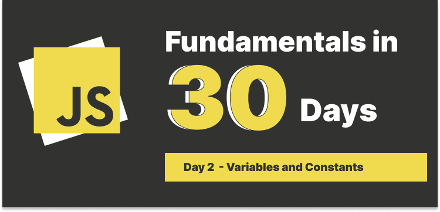

# Day 2: Variables and Constants



## Table of Contents

- [Variables](#variables)
- [What is a variable?](#what-is-a-variable)
- [What is a constants?](#what-is-a-constants)
  - [Key Differences](#key-differences)
  - [Scoped](#scoped)
    - [Let and Const Declarations](#let-and-const-declarations)
    - [Variable Statement](#variable-statement)
  - [LexicalEnvironment](#lexicalenvironment)
  - [VariableEnvironment](#variableenvironment)
  - [Key differences between LexicalEnvironment and VariableEnvironment](#key-differences-between-lexicalenvironment-and-variableenvironment)
- [Let’s practice and review the concepts that we’ve mentioned in this article.](#lets-practice-and-review-the-concepts-that-weve-mentioned-in-this-article)

## What is a variable?

A variable is a storage location that can hold a value. It can be changed during the execution.

In JavaScript, we can declare a variable using var, let, or const. In modern JavaScript, using let and const to declare a variable is the preferred option.

```js
var age = 23;
age = 24;

let height = 1.59;
height = 1.62;
```

## What is a constants?

Like a variable, but the value cannot be changed once it is assigned.

```js
const PI = 3.14;
PI = 3.14159; // This will throw an error
```

### Key Differences:

- Mutability
  - **Variables:** Value can be changed after they’re initialized.
  - **Constants:** Value cannot be changed once they’re initialized.
- Declaration:
  - Use let to declare a variable.
  - Use const to declare a constant.

### Scoped

#### Let and Const Declarations

> `let` and `const` declarations define variables that are scoped to the running execution context's `LexicalEnvironment`.

#### Variable Statement

> A `var` statement declares variables that are scoped to the running execution context's `VariableEnvironment`.

### LexicalEnvironment

- A specification type that defines the accessibility of variables and functions within a specific code execution context.
  Handle `block-scoped` variables (e.g., those declared with let and const).
- A new `LexicalEnvironment` is created each time a new scope is entered (e.g., function calls, block statements, etc.).

So…what is a `block-scoped` means? A `block-scoped` refers to the scope created by block statements (e.g., those within `{}`). Variables declared with let and const within these blocks are only accessible within the block.

```js
// Block-scoped
function greeting() {
  ...
};

if(true) {
...
} else {
...
};

for(...) {
...
}
```

### VariableEnvironment

- Similar to `LexicalEnvironment` in that it also comprises an environment record and an outer environment reference.
- Manage variable declarations within function scope and global scope (e.g., variables declared with `var`).
- When a function or global execution context is created, the `VariableEnvironment` stores variables declared with `var`.

### Key differences between LexicalEnvironment and VariableEnvironment

- **Scope Type:**
  - `LexicalEnvironment` handles variables declared with `let`, `const`, and `class` as well as function declarations.
  - `VariableEnvironment` handles variables declared with `var`.
- **Creation of Environment Records:**
  - In block scopes (e.g., if or for blocks), only a new `LexicalEnvironment` is created, not a new `VariableEnvironment`.
- **Scope Range:**
  - `LexicalEnvironment` has block scope characteristics.
  - `VariableEnvironment` has function scope characteristics (only within the function execution context).

---

### Let’s practice and review the concepts that we’ve mentioned in this article.

```js
function testScope() {
  var a = 1;
  let b = 2;
  const c = 3;

  if (true) {
    var a = 4;
    let b = 5;
    const c = 6;
    console.log(a); // ?
    console.log(b); // ?
    console.log(c); // ?
  }

  console.log(a); // ?
  console.log(b); // ?
  console.log(c); // ?
}

testScope();
```

### Answer

```js
function testScope() {
  var a = 1;
  let b = 2;
  const c = 3;

  if (true) {
    var a = 4;
    let b = 5;
    const c = 6;
    console.log(a); // 4
    console.log(b); // 5
    console.log(c); // 6
  }

  console.log(a); // 4
  console.log(b); // 2
  console.log(c); // 3
}

testScope();
```

### Explanation

Inside this `testScope` function, variable a has been modified from `1` to `4` inside the if statement. That's why when we `console.log(a)`, the answer was `4` instead of `1`, because a was managed by the `VariableEnvironment` and it lived in the whole function scope. Think of when we use var to declare a variable, it has the access to enter every room (function scope and block scope).

On the other hand, using `let` and `const` to declare variables means they are managed by the `LexicalEnvironment`. We can think of this as having two rooms: the first set of `b` and `c` lives in the room of the function scope, and the second set of `b` and `c` lives in the room of the if statement (block scope).

Therefore, when we `console.log(b)` and `console.log(c)` within the if block, the values were `5` and `6`, because it could only access the values within the if statement. When we try to `console.log(b)` and `console.log(c)` outside of the if statement, it can access the values within the function scope but cannot access the values that lived inside the if statement.
