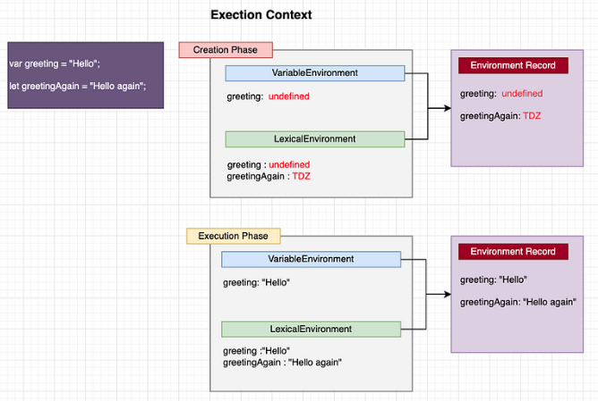

# Day 3: Execution Context


## Table of Contents

- [Execution Context](#execution-context)
  - [Creation Phase: When JS engine executes.](#creation-phase-when-js-engine-executes)
  - [Execution Phase: JS Starts to execute.](#execution-phase-js-executes)
  - [Conclusion](#conclusion)

> An execution context is a specification device that is used to track the runtime evaluation of code by an ECMAScript implementation.

When a execution context has been created, whether is a global scope execution context or function scope execution context, they all have 2 phases:

1. Creation phase.
2. Execution phase.

At the phase of creation, two environments and a record would be created.

1. VariableEnvironment

- If we declare a variable using var, the initial value would be undefined.
- If we declare a variables using let or const, in a status called TDZ (Temporal Dead Zone).
- Any function declarations.

2. LexicalEnvironment: Think of this as a range that could be accessed, this would be introduced when we talk about scope.
3. Environment Records.



---

### Execution Context

There are two phases when it comes to execution context, let's dive into it.

#### Creation Phase: When JS engine executes.

1. Create the `Global Execution Context`, think of this is the biggest room.
2. In the `Global Execution Context`, JavaScript stores all variables and function definitions. Think of this as giving those variables and functions name tags and assigning them positions in memory.

#### Execution Phase: JS executes.

1. Assign value to the variable that has been store in the `Global Execution Context`.
2. Execute functions ( e.g. greeting( ) )

- When executing functions, it create its own execution context ( creating its own room).

```js
var greeting = "Hello";

function sayHello(name) {
  console.log(greeting + " " + name);
}

sayHello("Joe");
```

First JS will "read" the code from top to bottom, then creates global execution context, and this phase is called Creation Phase, in this phase, there're several tasks that need to be done.

1. Storing variable and function definitions, think of creating two name tags, one is greeting which is a variable, another is sayHello, and it is a function.

- `greeting` => undefined
- `sayHello` => fn

Then we are moving forward to the second phase - Execution Phase.

1. Assigning value of `Hello` to variable `greeting`.
2. Executing `sayHello("Joe")`, this would create its own execution context, inside this execution context, it also has 2 phases like above, below is the breakdown of execution context of `sayHello("Joe")`.

- Creation phase:

  - Initialized parameter and assigned argument to it. ( name = "Joe")
  - `Console.log( greeting + " " + name)`, here we need to be aware of greeting was from global, because we couldn't find it inside the function, based on the scope chain, it reached out to the `global scope` (global execution context), and the name has the value of "Joe".

- Execution Phase:
  - console.log is a browser API, we can access this using globally.
  - log the result as Hello Joe .

---

### Conclusion

- When JS engine starts, it creates a `global execution context`.
  In every execution context, there would be two phases, the **creation phase** and **execution phase**.
- When in creation phase, 3 things would be initialized.
  - `VariableEnvironment`.
  - `LexicalEnvironment`.
  - `Environment` Record.
- `VariableEnvironment` is responsible for store variables declared using `var` and all the function declarations.
- `LexicalEnvironment` includes variableEnvironment and it stores variables that declared using `let` and `const `, and outer environment reference.
- When use `var` to declare a variable, **the initial value would be undefined**.
- When use `let` or `const` to declare a variable, it would be in **temporal dead zone (TDZ) until execution phase**.
