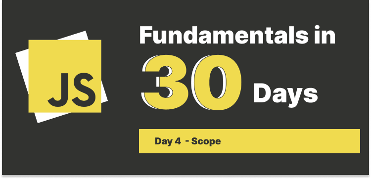

# Day 4: Scope



## Table of Contents:

- [Scope](#scope)
  - [Lexical Scope (Static Scope)](#lexical-scope-static-scope)
  - [Dynamic Scope](#dynamic-scope)
  - [Categories of Scope](#categories-of-scope)
    - [Global Scope](#global-scope)
    - [Function Scope](#function-scope)
    - [Block Scope](#block-scope)
  - [Comparison with var](#comparison-with-var)
  - [Conclusion](#conclusion)

Before we jump into what is scope in JS, we need to review some of
concepts: `Lexical Scope (Static Scope)` and `Dynamic Scope`, but wait
is Scope ?

### Scope

Imagine you’re at a big party in a huge mansion with multiple rooms. Each room has its own set of rules about what you can talk about and do. In programming, scope is like the “rules” for where certain things (like variables) can be seen and used.

#### Lexical Scope (Static Scope)

A portion of source code (area of text). The scope is determined when the programming language is interpreted, or we can say the scope is determined when the language **defined** the code.

```js
// Lexical Scope
function outerFunction() {
  var outerVar = "I am outside!";

  function innerFunction() {
    console.log(outerVar); // Here the outerVar is defined in the outerFunction
  }

  innerFunction();
}
outerFunction();
```

#### Dynamic Scope

A portion of runtime (period during execution). The scope is determined when the code is executed.

### Categories of Scope

We can simply category scopes, the global scope, the function scope and block scope, let's dive into it.

#### Global Scope

Any variables declared in the global scope that can be accessed globally.We can access variables inside a function or outside a function.

```js
var sayHey = "Hey!";
let greeting = "Hello";
const SayGoodBye = "Bye!";

function sayBye() {
  console.log("Inside function", sayHey);
  console.log("Inside function", greeting);
  console.log("Inside function", SayGoodBye);
}

sayBye();
console.log("In global", sayHey);
console.log("In global", greeting);
console.log("In global", ayGoodBye);
```

#### Function Scope

Any variables declared inside the function that can only be accessed within the function.

```js
function sayBye() {
  let bye = "Bye bye!"; // or declare using var or const
  console.log(bye);
}

sayBye(); // "Bye bye"
console.log(bye); // bye is not defined
```

#### Block Scope

Variables declared using `let` and `const`, the variables are only accessible within the block they are declared in.

```js
{
  let greeting = "Hello World!";
}

console.log(greeting); // ReferenceError: greeting is not defined
```

### Comparison with var

Variables declared using `var` are not limited to block scope, but they do have function scope and global scope.
The reason why using `var` can still be accessed in `block-scope` is because the concept that we've mentioned above.

```js
{
  var greeting = "Hello World!";
}

console.log(greeting); // Hello World!
```

Imagine the code like this, it seemed var variable was hoisted like below.

```js
var greeting; // The initial value was undefined during creation phase

{
  greeting = "Hello World!"; // Assigned "Hello World!" during execution phase
}

console.log(greeting);
```

But what happened behind the scene was JS "read" codes first and executed afterwards, remember the 2 phases when JS created the global execution context?
Creation phase:

- Stored variable greeting and initialized the value of `undefined`.
  Execution phase:
- Executed the code, assign the value of "Hello World!" to variable greeting.

### Conclusion

- There're three scopes in JS:

  - Global Scope
  - Function Scope
  - Block Scope

- Global Scope:

  - Any variable or function declared outside of any function, block, or module resides. Variables and functions in the global scope can be accessed from anywhere in the code, see example below.

    ```js
    // Global Scope
    let greeting = "Hello World!";
    function sayHey() {
      console.log("Hey there!");
    }
    function sayHello() {
      console.log(greeting);
    }

    console.log(greeting); // Hello World!
    sayHey(); // Hey there!
    sayHello(); // Hello World
    ```

- Function Scope:

  - Any variable or function declared inside a function is accessible only within that function and is not accessible from outside it. This is also known as local scope.
  - Take a look the code below, do you know the answer?

  ```js
  function outerFunction() {
    let myVariable = "I am in function scope";

    function innerFunction() {
      console.log(myVariable + ", i can access myVariable");
    }
    console.log(myVariable);
    innerFunction();
  }

  console.log(myVariable); // ❌ ReferenceError: myVariable is not defined.
  innerFunction(); // => ❌ ReferenceError: innerFunction is not defined.

  // If we want to console.log myVariable and innerFunction,
  // we can simply invoke outerFunction()
  // It will console.log(myVariable) first, then execute innerFunction() and
  // console.log(myVariable + ", i can access myVariable")
  ```

- Block Scope:

  - The scope of variables declared with `let` and `const` within a block (a pair of curly braces `{}`). These variables are only accessible within the block they are declared in and are not accessible from outside that block.

  ```js
  {
    let helloByLet = "Hello, usng let";
    const helloByConst = "Hello, using const";
    var helloByVar = "Hello, using var";

    console.log(helloByLet); // ✅
    console.log(helloByConst); // ✅
    console.log(helloByVar); // ✅
  }

  console.log(helloByLet); // ❌ ReferenceError: helloByLet is not defined
  console.log(helloByConst); // ❌ ReferenceError: helloByConst is not defined
  console.log(helloByVar); // ✅
  ```

- When is Scope Determined?
  - Scope is determined at the time the code is written. In JavaScript, whenever you create a new function or code block (such as `if`, `for`, `while`, etc.), a new lexical scope is created. These scopes are determined before the code is executed.
