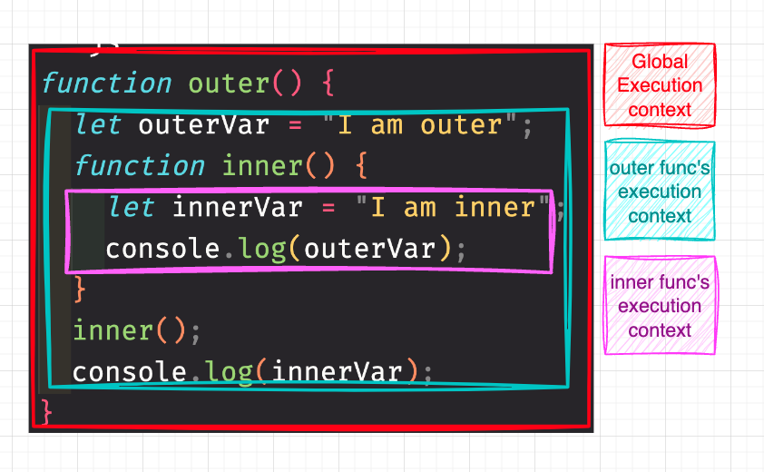

# Day 5: Closure


## Table of Contents

- [Characteristics of Closure](#characteristics-of-closure)
- [Characteristics of scope chain](#characteristics-of-scope-chain)
- [Why outer function cannot access inner function variable?](#why-outer-function-cannot-access-inner-function-variable)
- [Try to explain the following code:](#try-to-explain-the-following-code)
- [Pros of using closure?](#pros-of-using-closure)
- [Cons of using closure?](#cons-of-using-closure)
- [Conclusion](#conclusion)

---

### Characteristics of Closure

- If a function with closures, we can say that this function is not a pure function.
- A closure in JavaScript refers to a function that remembers its `lexical environment` at the time of creation.

---

### Characteristics of scope chain

- The scope chain is a list of objects that are searched for an identifier.
- Inner functions can access variables from their outer scope, but outer functions cannot access variables from their inner scope.

```js
function outer() {
  let outerVar = "I am outer";
  function inner() {
    let innerVar = "I am inner";
    console.log(outerVar);
  }
  inner();
  console.log(innerVar);
}
```

Below demonstrates the execution context of the above code:



#### Why outer function cannot access inner function variable?

Let's review when does lexical scope is created:

- When a function is declared, which is in creation phase, instead of execution phase, that means the scope of a function is determined at the time of declaration, establishing the range of accessible variables during its creation phase.

- In JavaScript, the scope chain is unidirectional, looking up variables from the inside out, allowing inner functions to remember and access variables from outer functions, even to the global scope and even after the outer function has finished executing.

#### Try to explain the following code:

```js
function outerFunction() {
  var outerVariable = "Hello, ";
  function innerFunction(name) {
    console.log(outerVariable + name);
  }
  return innerFunction;
}
var inner = outerFunction();
inner("John"); // Output: Hello, John

// Or you prefer to write it like this:

outerFunction()("John"); // Output: Hello, John
```

1. We declare a function `outerFunction` and inside it, we declare a variable called `outerVariable`, a function called `innerFunction` and return `innerFunction`.
2. `innerFunction` takes a parameter `name` and logs `outerVariable + name`.
3. We declare a variable `inner` and assign the return value of `outerFunction` to it, which is `innerFunction`.
4. We call `inner` with a argument `John`.

#### Pros of using closure?

- **Data privacy / Encapsulation / keeping state**

```js
function counter() {
  let count = 0;
  return function () {
    return ++count;
  };
}

// We can leverage closure to create different counter

let counter1 = counter();
let counter2 = counter();

console.log(counter1()); // Output: 1

console.log(counter2()); // Output: 1

// They won't affect each other
```

- **Modulization**

```js
// (function() {...})() is an IIFE (Immediately Invoked Function Expression)
function counterModule(function() {
  // This is a private variable, only accessible within the module
  let count = 0;

  // This is a private function, only accessible within the module
  function getCount(num) {
    return count += num;
  }

  // This is a public function, accessible from outside the module
  return {
    increment: function() {
      return ++count;
    },
    decrement: function() {
      return --count;
    },
    getCount: function() {
      return count;
    },
  };
})();

console.log(counterModule.getCount()); // Output: 0
counterModule.increment();
console.log(counterModule.getCount()); // Output: 1
counterModule.decrement();
console.log(counterModule.getCount()); // Output: 0
```

- **Memoization**

Because it can remember the previous result, we can use it to cache the result.

```js
function memoizeSquare() {
  // Declare a cache object
  const cache = {};

  // Return a function that takes a parameter n
  return function (n) {
    // If the result is already in the cache, return it
    if (cache[n] !== undefined) {
      console.log("Fetching from cache:", n);
      return cache[n];
    }

    // Otherwise, calculate the result
    console.log("Calculating result:", n);
    const result = n * n;

    // Store the result in the cache
    cache[n] = result;

    // Return the result
    return result;
  };
}

const square = memoizeSquare();

console.log(square(4)); // Calculating result: 4, Output: 16
console.log(square(4)); // Fetching from cache: 4, Output: 16
console.log(square(5)); // Calculating result: 5, Output: 25
console.log(square(5)); // Calculating result: 5, Output: 25
```

- **Delay execution**

```js
function delayExecution() {
  return function (fn, delay) {
    setTimeout(fn, delay);
  };
}

const delay = delayExecution();

delay(() => console.log("Hello, World!"), 1000); // Output: Hello, World! (after 1 second)
```

#### Cons of using closure?

- **Memory leak**
  We mentioned that using closure can keep the state, can do memoization, but if we don't use it properly, it can cause memory leak due to the closure keeping the reference to the outer scope, even if the outer scope is no longer needed.

  That's keep in simple, even if the outer function is ended, the inner function still alive (keeps the reference to the outer scope).

  ```js
  function outer() {
    let outerVar = "I am outer";
    function inner() {
      let innerVar = "I am inner";
      console.log(outerVar);
    }
    return inner;
  }
  ```

  In the above code, the `inner` function keeps the reference to the `outer` function, even if the `outer` function is ended, the `inner` function still alive.

  That's why we need to implement a cleanup function to avoid memory leak.

  ```js
  function outer() {
    let outerVar = "I am outer";
    function inner() {
      let innerVar = "I am inner";
      console.log(outerVar);
    }
    return inner;
  }

  const fun1 = outer();
  fun1(); // Output: I am outer

  // cleanup
  fun1 = null;
  ```

- **Performance**
  Because the closure keeps the reference to the outer scope, it needs to keep the scope chain, which can cause performance issues.

- **Hard to debug**
  Because the closure keeps the reference to the outer scope, it can be hard to debug, especially when the closure is deeply nested.

---

### Conclusion

- Closure is determined when a function is declared at the time of creation, in a simple term, it determine when JS engine "read" the code, and this is called **static scope** or **lexical scope**, the opposite of **dynamic scope** which is determined when the function is called.
- Function with closure is not a pure function.
- Closure can keep the state, do memoization, delay execution, but it can cause memory leak, performance issues, and hard to debug.
- Only inner function can access the outer function variable, but outer function cannot access the inner function variable.
- A **Scope Chain** means that the inner function can access the outer function variable,and if the outer function has no variable, it will look up to the global scope.
