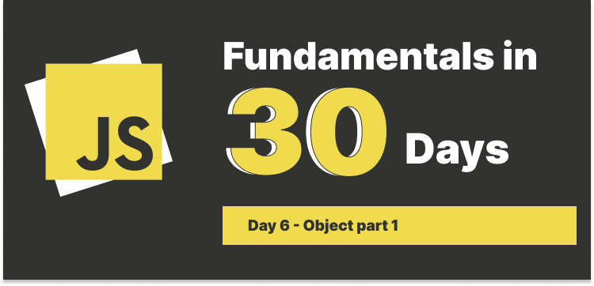

# Day 6: Object part 1



## Table of Contents

- [Types in JavaScript](#types-in-javascript)
- [How to create an object](#how-to-create-an-object)
  - [What is literal?](#what-is-literal)
  - [What is a constructor?](#what-is-a-constructor)
  - [What is an instance?](#what-is-an-instance)
- [Accessing object properties](#accessing-object-properties)
- [Compute property (introduced in ES6)](#compute-property-introduced-in-es6)
- [Property shorthand](#property-shorthand)
- [Checking if a property exists](#checking-if-a-property-exists)
  - [The `in` operator](#the-in-operator)
  - [The `hasOwnProperty` method](#the-hasownproperty-method)
  - [Object.keys](#objectkeys)
  - [Object.values](#objectvalues)
  - [Object.entries](#objectentries)

---

When I started learning JavaScript, `object` was one of the most confusing topics for me, especially when I was trying to understand the concept of `this` keyword, `prototype`, `__proto__` and `inheritance`, these sort of big words were hard for me to understand.

Since `object` is a complex topic, I will be breaking it down into smaller parts to make it easier to understand.

### Types in JavaScript

Before jumping into the `object`, let's review what kind of data types in JavaScript, as we already know that there're 7 types of data in JavaScript, and they are primitives.

1. Number
2. String
3. Boolean
4. Undefined
5. Null
6. Symbol
7. BigInt (introduced in ES2020)

When we say something is a primitive value,this means it is a very basic data type and it has several characteristics:

- It is **immutable**, which means it can't be changed.
- It **has no properties or methods**.
- It is stored in a variable directly.

What about `object`? `Object` is a **non-primitive** value, and it has several characteristics:

- It is a **key-value pair**, but the value can be more complex, e.g., another object, an array, or a function.
- It is **mutable**, which means it can be changed.
- For properties, there's no limitation on the key name, it can be a string, a number, or a symbol or a preserver word, e.g., `for`, `let`, `class`, etc, but we **CAN'T** use `__proto__` as a key name.

### How to create an object

We can create an object in various way, including via a `literal notation (a bracket {...})` or a `constructor`.

#### What is literal?

In CS, `literal` is a notation for representing a fixed value in source code. Examples of literals include numbers, strings, and objects.

```js
const person = {
  firstName: "John",
  lastName: "Doe",
  age: 50,
  greeting: function () {
    return `Hello, my name is ${this.firstName} ${this.lastName}. I am ${this.age} years old.`;
  },
};

console.log(person.greeting()); // Hello, my name is John Doe. I am 50 years old.
```

#### What is a constructor?

A constructor is a function that creates an instance of a class that is typically called an "object". In JavaScript, a constructor gets called when you declare an object using the `new` keyword.

- Usually we capitalize the first letter of the constructor function to distinguish it from other functions.

```js
function Person(firstName, lastName, age) {
  this.firstName = firstName;
  this.lastName = lastName;
  this.age = age;
  this.greeting = function () {
    return `Hello, my name is ${this.firstName} ${this.lastName}. I am ${this.age} years old.`;
  };
}
```

- Use the `new` keyword to create an **instance** of the `Person` object.

```js
const person1 = new Person("John", "Doe", 50);
const person2 = new Person("Jane", "Doe", 40);
```

#### What is an instance?

An instance is an object that is created from constructor function or class.

- constructor function

```js
function Person(name, age) {
  this.name = name;
  this.age = age;
  this.greet = function () {
    console.log(`Hello, I am ${this.name}, I am ${this.age} years old`);
  };
  // Or you can write this.greet = () => {...}
}

const person1 = new Person("John", 40);
// Access Person's method
person1.greet(); // Hello, I am John, I am 40 years old.
```

- class

```js
class Person {
  constructor(name, age) {
    this.name = name;
    this.age = age;
  }

  greet() {
    console.log(`Hello, I am ${this.name}, I am ${this.age} years old`);
  }
}

const person1 = new Person("John", 40);
person1.greet(); // Hello, I am John, I am 40 years old.
```

> Arrow function is another topic that I will cover when we get into the `function` topic.

### Accessing object properties

We can use dot notation or bracket notation to access object properties.

```js
// Dot notation
console.log(person1.firstName); // John

// Bracket notation
console.log(person2["lastName"]); // Doe
```

Trivia: If a key is a multi-word string, you can't use dot notation to access it, you must use bracket notation.

```js
const anotherPerson = {
  firstName: "Joe",
  "has a dog": true,
};

// Dot notation
console.log(anotherPerson.has a dog); // SyntaxError: Unexpected identifier

// Bracket notation
console.log(anotherPerson["has a dog"]); // true
```

### Compute property (introduced in ES6)

This allows you to compute the property name in an object literal based on an expression.

```js
let prop = "name";
let id = "1234";

const user = {
  [prop]: "John",
  [`user_${id}`]: "John",
};

console.log(user); // { name: 'John', user_1234: 'John' }
```

### Property shorthand

This is a shorthand for initializing properties **from variables with the same name**.

```js
let firstName = "John";
let lastName = "Doe";

// We can use the same variable name as the key name
const user = {
  firstName: firstName,
  lastName: lastName,
};

// Or we can use the shorthand
const user = {
  firstName,
  lastName,
};
```

### Checking if a property exists

We can check if a property exists in an object in several ways.

#### The `in` operator

It returns `true` if the specified property is in the object.

```js
let person = {
  firstName: "John",
  lastName: "Doe",
};

console.log("firstName" in person); // true
console.log("age" in person); // false
```

#### The `hasOwnProperty` method

This returns a boolean indicating whether the object has the specified property as its own property.

```js
let person = {
  firstName: "John",
  lastName: "Doe",
};

console.log(person.hasOwnProperty("firstName")); // true
console.log(person.hasOwnProperty("age")); // false
```

#### Object.keys

This returns an array of a given object's own enumerable property names.

```js
let person = {
  firstName: "John",
  lastName: "Doe",
};

let keys = Object.keys(person);
console.log(keys); // [ 'firstName', 'lastName' ]
console.log(keys.includes("firstName")); // true
console.log(keys.includes("age")); // false
```

#### Object.values

This returns an array of a given object's own enumerable property values.

```js
let person = {
  firstName: "John",
  lastName: "Doe",
};

let values = Object.values(person);
console.log(values); // [ 'John', 'Doe' ]
console.log(values.includes("John")); // true
console.log(values.includes("Doe")); // true
console.log(values.includes("age")); // false
```

#### Object.entries

This returns an array of a given object's own enumerable string-keyed property `[key, value]` pairs.

```js
let person = {
  firstName: "John",
  lastName: "Doe",
};

let entries = Object.entries(person);
let hasValueJohn = entries.some(([key, value]) => value === "John");
let hasValeAge = entries.some(([key, value]) => key === "age");

console.log(hasValueJohn); // true
console.log(hasValeAge); // false
```
