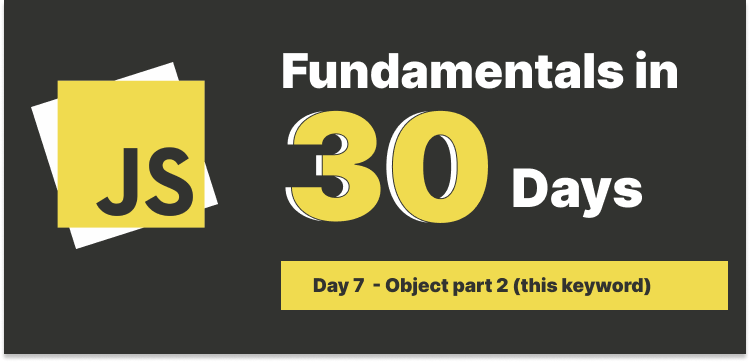

# Day 7: Object part 2



## Table of Contents

- [Review object part 1](#review-object-part-1)
- [When is the this Keyword Determined?](#when-is-the-this-keyword-determined)
- [this in global context](#this-in-global-context)
- [this in function context](#this-in-function-context)
  - [Regular function call](#regular-function-call)
  - [Method call](#method-call)
  - [call, apply, bind method](#call-apply-bind-method)
  - [Constructor call](#constructor-call)
  - [Arrow function call](#arrow-function-call)
- [Conclusion](#conclusion)

### Review object part 1

In part 1, we have talked about several topics, including:

- Type in JavaScript
- How to create an object
- How to access object properties
- Compute property (introduced in ES6)
- Property shorthand
- Checking if a property exists

Let's move on to next a bit confused topic: `this` keyword. You may see this before.

```js
const person = {
  firstName: "John",
  lastName: "Doe",
  age: 50,
  greeting: function () {
    return `Hello, my name is ${this.firstName} ${this.lastName}. I am ${this.age} years old.`;
  },
};

console.log(person.greeting()); // Hello, my name is John Doe. I am 50 years old.
```

What's in you mind when you see code above? It might seem that `this` is something that we can use to access `firstName`, `lastName`, and `age` properties. and you are right. `this` is a special keyword that refers to the object that is currently being executed.

But why not just use something like `${person.firstName}`, would this be more straightforward? Yes, it would be, but what if we make a copy of `person` object, and we overwrite it?

#### ❗❗ Pass by reference vs. pass by value

#### What is a reference?

In computer science, a reference is a value that enables a program to **indirectly** access a variable's value or a record, in the computer's memory or in other storage device.

A reference refers to data stored in memory on a given system, and its internal value is the **memory address** of the data.

#### Data types that are passed by reference in JavaScript

There are two types of data in JavaScript that are passed by reference: `object`, `arrays` and `functions`, also known as `reference types`, other data types are passed by value, which are called `primitive types`.

> Note: Object, arrays and functions are all objects.

#### What exactly is pass by reference?

When we pass a reference type to a function, we are passing a reference to the memory location of the object, not the actual object itself, so when we make a change to the object, we are changing the actual object, take a look at the following example:

```js
const person = {
  firstName: "John",
  lastName: "Doe",
  age: 50,
  greeting: function () {
    return `Hello, my name is ${this.firstName} ${this.lastName}. I am ${this.age} years old.`;
  },
};

const anotherPerson = person;

// Change age
anotherPerson.age = 20;

// This is the result of person Hello, my name is John Doe. I am 20 years old.
console.log("This is the result of person", person.greeting());

// This is the result of anotherPerson Hello, my name is John Doe. I am 20 years old.
console.log("This is the result of anotherPerson", anotherPerson.greeting());
```

See that age is changed to 20 for both `person` and `anotherPerson` object.

Let's take a look if we use `primitive data types`.

```js
let name = "John";

let anotherName = name;

anotherName = "Jack";

// This is the result of name John
console.log("The result of name", name);

// This is the result of anotherName Jack
console.log("The result of anotherName", anotherName);
```

When we assign an object to another variable, we are passing the reference, not a copy of the object,instead, when we assign a primitive data type to another variable, we are passing a copy of the value, not the reference.

We have mentioned that a reference is a memory address, think of we give the assigned variable the key to the house, we can actually go inside and move around or even change items.

And when pass by value, we can think of not having a key, instead, we copy all the stuffs and move out of the house, the items are identical, but when we change one of the items in the new house, the original house is not affected.

Back to the `this` keyword, it is en entity that refers to the object that is currently being executed, so if we use something like `${person.firstName}` directly, it would be easy to modify the code and also easy to get errors, for example:

```js
const person = {
  firstName: "John",
  greeting: function () {
    console.log(`Hello, my name is ${person.firstName}.`);
  },
};
let anotherPerson = person;

// modify the person object
person.firstName = null;

// This is the result of person Hello, my name is null.
person.greeting();

// This is the result of anotherPerson Hello, my name is null.
anotherPerson.greeting();
```

---

### When is the this Keyword Determined?

In JavaScript, `this` is determined when **execution context is created** and it is based on **how a function is called**.

There types of execution context, including:

- **Global execution context**

  When JS engine starts executing the code, it creates a `global context`.

- **Functional execution context**

  When a function is called, a new `functional context` is created.

- **Eval execution**

  When `eval` function is called, a new `eval context` is created.

Three of them include three components:

1. Variable environment
2. Lexical environment
3. `this` keyword

Let's dive into it.

---

### `this` in global context

When `this` is used in the global context, it refers to the `global object`, which is `window` object in the browser and `global` object in Node.js.

```js
// browser
console.log(this === window); // true

this.firstName = "John";
this.lastName = "Doe";

console.log(this.firstName); // John

// In Node.js, a bit different
console.log(this === global); // false
```

The reason why `this` is not equal to `global` object in Node.js is that Node.js wraps the code in a function(has its own execution context), so `this` refers to the `module.exports` object.

```js
console.log(this === module.exports); // true
```

---

### `this` in function context

Five types of function invocation:

#### Regular function call:

It has two modes:

- **Strict mode**

  In strict mode, `this` is `undefined`. It is a way to avoid accidentally creating global variables.

  ```js
  "use strict";

  function greeting() {
    console.log(this);
  }

  greeting(); // undefined
  ```

- **Non-strict mode**

  In non-strict mode, `this` refers to the `global object`.

  ```js
  function greeting() {
    console.log(this);
  }

  greeting(); // window object
  ```

---

#### Method call:

When a function is called as a method of an object, `this` refers to the object that is calling the method.

```js
const person = {
  firstName: "John",
  lastName: "Doe",
  age: 50,
  greeting: function () {
    console.log("Hello my name is", this.firstName);
  },
};

person.greeting(); // Hello my name is John
```

#### `call`, `apply`, `bind` method:

We can use `call`, `apply`, `bind` method to change the value of `this` keyword.

- `call` method: It is used to call a function with a given `this` value and arguments provided individually.

  ```js
  const person1 = {
    firstName: "John",
    lastName: "Doe",
  };

  function greeting() {
    console.log(`Hello my name is ${this.firstName} ${this.lastName}`);
  }

  greeting.call(person1); // Hello my name is John Doe
  ```

- `apply` method: It is used to call a function with a given `this` value and arguments provided as an array.

  ```js
  const person1 = {
    firstName: "John",
    lastName: "Doe",
  };

  function greeting() {
    console.log(`Hello my name is ${this.firstName} ${this.lastName}`);
  }

  greeting.apply(person1); // Hello my name is John Doe
  ```

- `bind` method: It is used to create a new function that, when called, has its `this` keyword set to the provided value.

  ```js
  const person1 = {
    firstName: "John",
    lastName: "Doe",
  };

  function greeting() {
    console.log(`Hello my name is ${this.firstName} ${this.lastName}`);
  }

  const newGreeting = greeting.bind(person1);

  newGreeting(); // Hello my name is John Doe
  ```

---

#### Constructor call:

When a function is called with the `new` keyword, `this` refers to the newly created object.

```js
function Person(name) {
  this.name = name;
}

let pserson1 = new Person("John");
let pserson2 = new Person("Alex");

console.log(pserson1.name); // John
console.log(pserson2.name); // Alex
```

---

#### Arrow function call:

Arrow functions **DO NOT** have their own `this` value, `this` is determined by the surrounding lexical context.

```js
const person = {
  firstName: "John",
  lastName: "Doe",
  age: 50,
  greeting: function () {
    const innerFunction = () => {
      console.log("Hello my name is", this.firstName);
    };

    innerFunction();
  },
};

person.greeting(); // Hello my name is John
```

<details>
<summary>
  Try to explain the output of the following code snippet
</summary>

```js
// Code 1
const person1 = {
  firstName: "John",
  lastName: "Doe",
  age: 50,
  greeting: function () {
    console.log(`Hello I am ${this.firstName}`);
  },
};

person1.greeting();
```

```js
// Code 2
const person2 = {
  firstName: "John",
  lastName: "Doe",
  age: 50,
  greeting: () => {
    console.log(`Hello I am ${this.firstName}`);
  },
};

person2.greeting();
```

Can you tell each `this` refers to what object?

</details>

<details>
<summary>Answer</summary>

- Code 1: `this` refers to `person1` object.
- Code 2: `this` refers to the `window object` in browser or `global object` in node.js because arrow function does not have its own `this` value.

Follow up question: Can you tell which object `this` refers to in the following code snippet?

```js
// Code 3
const person = {
  firstName: "John",
  greeting: function () {
    function hello() {
      console.log(`Hello I am ${this.firstName}`);
    }
    hello();
  },
};

person.greeting();
```

- In code 3, we added another function `hello` inside of greeting function, it may seem that `this` refers to `person object`, but it is not.

- We can treat the `hello()` function as a **regular function**, therefore, `this` refers to the `window object` (`global object` in node.js).

- The output of the code is `Hello I am undefined`.

##### How to fix it?

- Use arrow function instead of regular function.

```js
const person = {
  fisrtName: "John",
  greeting: function () {
    const hello = () => {
      console.log(`Hello I am ${this.firstName}`);
    };
    hello();
  },
};

person.greeting(); // Hello I am John
```

- Use `bind` method.

```js
const person = {
  firstName: "John",
  greeting: function () {
    function hello() {
      console.log(`Hello I am ${this.firstName}`);
    }
    hello.bind(this)();
  },
};
```

- Use `self` or `that` variable.

```js
const person = {
  firstName: "John",
  greeting: function () {
    const self = this; // or that = this;
    function hello() {
      console.log(`Hello I am ${self.firstName}`);
      // console.log(`Hello I am ${that.firstName}`);
    }
    hello();
  },
};

person.greeting(); // Hello I am John
```

</details>

---

### Conclusion

- `this` is a keyword that refers to the object that is currently being executed,
- `this` is determined when execution context is created and it is based on how a function is called,
- When is global execution context, `this` refers to the `window object` in the browser and `global object` in Node.js.
- When a function is called as a method of an object, `this` refers to the object that is calling the method.
  - Regular function call: `this` is `undefined` in strict mode, and `window object` in non-strict mode.
  - Method call: `this` refers to the object that is calling the method.
  - Constructor call: `this` refers to the newly created object.
  - Arrow function call: `this` is determined by the surrounding lexical context.
- Arrow functions **DO NOT** have their own `this` value.
