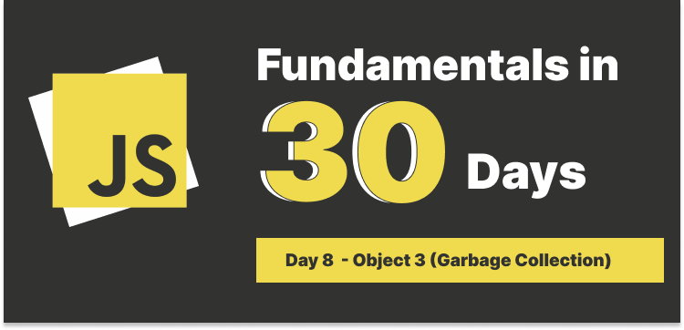

# Day 8 Object Part 3 (Garbage Collection)



## Table of Contents

### Before we talk about Garbage Collection

Here we need to understand a bit about **memory management**, we can simplify as there are two types of systems:

- **Stack**
- **Heap**

#### Stack

It is an abstract data type that serves as a collection of elements, with two main principal operations: **push** and **pop**, it stores data that are primitive data, e.g., numbers, strings, etc.

#### Heap

It is a memory that is used to store complex data types, e.g., objects, arrays, etc.

### What is Garbage Collection?

The idea of garbage collection was invented by John McCarthy, it is a form of **automatic memory management**, to reclaim the memory occupied by objects that are no longer in use by the program.

#### Non-automatic memory management

Before automatic memory management was introduced, programmer has to identify and deallocate unused objects or other data manually. This is called **manual memory management**.

Languages like C and C++ require manual memory management. In these languages, the programmer must explicitly allocate memory for objects and deallocate memory when the object is no longer needed.

GArbage collection is important when it comes to a program's performance and memory usage.

#### Basic algorithm of Garbage Collection

It is called **mark-and-sweep**, the algorithm works in two phases:

1. **Mark phase**: The garbage collector traverses the object graph starting from the root objects and marks all objects that are reachable from the root objects.

2. **Sweep phase**: The garbage collector traverses the heap and deallocates objects that are not marked.

In a simle explanation, the garbage collector marks all objects that are reachable from the root objects and then removes all objects that are not marked.

Now that's talk about in what situations can cause unreachable objects.

### Unreachable Objects

When the reference to an object is lost. We have mentioned a very important topic called **pass by reference**, and data types like **arrays**, **objects** or **functions** are passed by reference in JavaScript.

Let's take a simple example:

```javascript
let obj1 = { name: "John" };
```

Here we declare a global variable `obj1`, and assign an object `{name: "John"}` to it, so it has a reference to the object.

```javascript
obj1 = null;
```

Now we assign `null` to `obj1`, the object `{name: "John"}` is no longer reachable, because there is no reference to it, therefore it is a garbage object, so the garbage collector will remove it.

If we assign `obj1` to another object called `obj2`, it means that obj2 also has a reference to the object `{name: "John"}`, since we only assign `null` to `obj1`, the reference to the `obj2` still remains, it won't be removed by the garbage collector.

```javascript
let obj1 = { name: "John" };
let obj2 = obj1;
obj1 = null;

console.log(obj1); // null
console.log(obj2); // {name: "John"}
```
