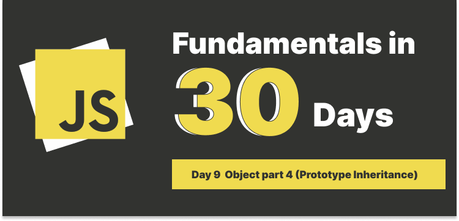
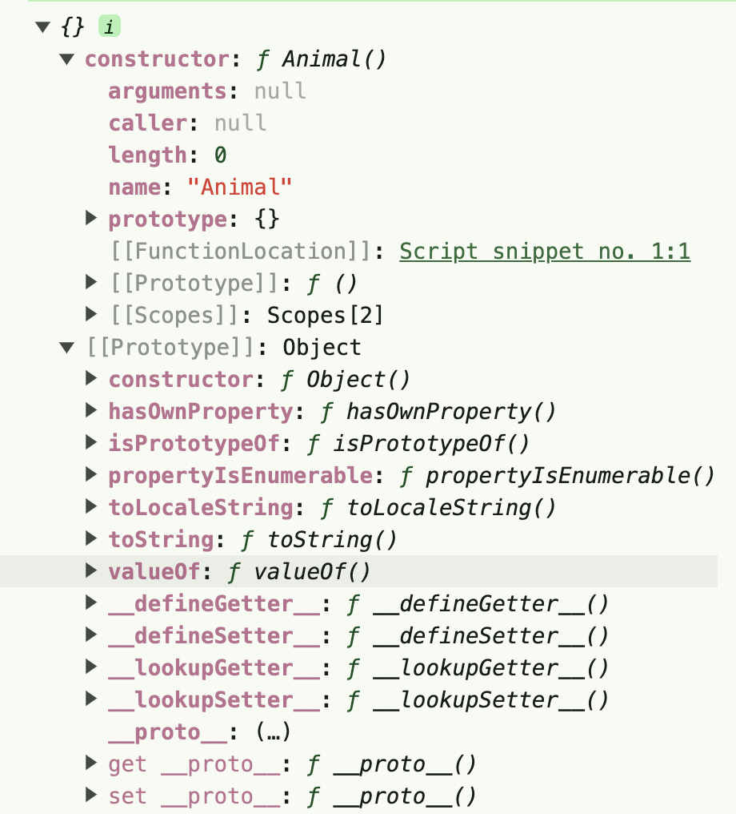

# Day 9 Object Part 4 (Prototype Inheritance)



## Table of Contents

Some people say that JavaScript is an OOP (Object-Oriented Programming) language, while others say it is not. I don't want to argue which one is correct, simply because JavaScript has been a language created under a business need (pressures?) and Mr. Eich created it in 10 days (this is crazy), it's clear that JS has its mysterious parts that confused people, me as well, but dig into it and try to figure out how it works is fun, os perhaps we can just embrace its nature and learn how to use it.

### What is Prototype-based programming?

Prototype-based programming is a style of OOP, and OOP language allows inheritance for code reuse and extendability, there're two forms of inheritance(or I should say two styles of inheritance):

1. Class-based inheritance
2. Prototype-based inheritance

---

### Short brief of Class-based inheritance

- Using classes to create objects.
- Objects/instances are created from classes.
- Using a method called `constructor` to initialize objects.
- All the methods available in the parent class are available in the child class.

Let's use python and JavaScript to create a Vehicle class and a child class called Car.

#### Python as an example

```python
# Python
class Vehicle:
    def __init__(self, brand, model):
        self.brand = brand
        self.model = model

# No overriding parent class
class Car(Vehicle):
    pass # Inherit everything automatically

# Overriding parent class, adding new attribute
class Truck(Vehicle):
    def __init__(self, brand, model, year):
        # Call methods from Vehicle
        super()._init__(brand, model)
        self.year = year

newCar = Car("Toyota", "Corolla")

print(newCar.brand) # Output: Toyota
print(newCar.model) # Output: Corolla

newTruck = Truck("Toyota", "Hilux", 2020)

print(newTruck.brand) # Output: Toyota
print(newTruck.model) # Output: Hilux
print(newTruck.year) # Output: 2020

```

#### JavaScript as an example

```javascript
class Vehicle {
  constructor(brand, model) {
    this.brand = brand;
    this.model = model;
  }
}

// No overriding parent class
class Car extends Vehicle {}

// Overriding parent class, adding new attribute
class Truck extends Vehicle {
  constructor(brand, model, year) {
    super(brand, model);
    this.year = year;
  }
}

newCar = new Car("Toyota", "Corolla");
console.log(newCar.brand); // Output: Toyota
console.log(newCar.model); // Output: Corolla

newTruck = new Truck("Toyota", "Hilux", 2020);

console.log(newTruck.brand); // Output: Toyota
console.log(newTruck.model); // Output: Hilux
console.log(newTruck.year); // Output: 2020
```

---

Ok, we have learned how to create classes and child classes using JavaScript, so does JavaScript a OOP language? I'd say it's not a pure OOP language, but since prototype-based inheritance is a style of OOP, I'd like to say it is a branch of OOP. (This is the way I understand it, if you have a different opinion, please let me know.)

### Prototype-based inheritance

JavaScript is a prototype-based language, before **es6**, we use can declare a object using curly braces `{}` and use `Object.create()` to create a new object and assign the prototype of the object to the parent object or we can use `constructor functions`, below are standard methods.

#### Using Object.create()

```javascript
const Vehicle = {
  brand: "Toyota",
  model: "Corolla",
};

const Car = Object.create(Vehicle);

console.log(Car.brand); // Output: Toyota
console.log(Car.model); // Output: Corolla
```

#### Using constructor functions

```javascript
// Using constructor functions
function Vehicle(brand, model) {
  this.brand = brand;
  this.model = model;
}

function Car(brand, model) {
  Vehicle.call(this, brand, model);
}

Car.prototype = Object.create(Vehicle.prototype);

const newCar = new Car("Toyota", "Corolla");

console.log(newCar.brand); // Output: Toyota
console.log(newCar.model); // Output: Corolla
```

#### Using ES6 Classes

```javascript
class Vehicle {
  constructor(brand, model) {
    this.brand = brand;
    this.model = model;
  }
}

class Car extends Vehicle {}

const newCar = new Car("Toyota", "Corolla");

console.log(newCar.brand); // Output: Toyota
console.log(newCar.model); // Output: Corolla
```

---

### Using Class, so...we can call it a class-based inheritance?

Under the hood, even we use `class`, it is still a constructor function, don't believe me? Let's see the following code.

```javascript
class Vehicle {
  constructor(brand, model) {
    this.brand = brand;
    this.model = model;
  }
}

console.log(typeof Vehicle === "function"); // Output: true
```

That's way some say `class` is a syntax sugar, because it doesn't make JavaScript a class-based language, it is still a prototype-based language.

### Prototype Chain

Have you ever wondered why we can use some of methods like `toString()` or `valueOf()` ...etc in JavaScript? This is because of the prototype chain, how does prototype chain work? Let's see the following code.

```javascript
function Animal() {
  this.name = "動物";
}

console.log(Animal.prototype);
```



When we `console.log(Animal.prototype)`, we've got two very important properties, `constructor` and `prototype`, but there's another property called `__proto__`, so what's the different between `prototype` and `__proto__`?

#### `prototype` vs. `__proto__`

when we create a **constructor function**, JavaScript will automatically create a `prototype` object, this object contains the methods and properties that we can use in the instances, for example:

```js
function Animal(name) {
  this.name = name;
}

Animal.prototype.bark = function () {
  console.log(this.name + " is barking");
};

console.log(Animal.prototype); // Output: { bark: [Function] }
```

Let's walk through the code above.

- We created a constructor function called `Animal`, and it takes a parameter called `name`.
- We created a method called `bark`, and assign it to the `prototype` object.
- `console.log(Animal.prototype)` will output `{ bark: [Function] }`.

You probably noticed that the output doesn't contain the `name` property, this is because the `name` property is assigned to the instance, not the prototype object, it's call `instance property`, and the `bark` method is assigned to the prototype object, it's called `prototype property`.

Now, let's create an instance and see if the instance has inherited the `bark` method.

```javascript
const dog = new Animal("Bob");
console.log(dog.bark()); // Output: Bob is barking

console.log(dog.prototype); // Output: undefined

console.log(dog.__proto__); // Output: { bark: [Function] }
```

You may wonder why it outputs `undefined` when we `console.log(dog.prototype)`, this is because the `prototype` property is only available in the constructor function, not the instance, but the `__proto__` property is available in the instance, and it points to the prototype object.

Based on the code above, we can see that the `__proto__` property "links" the `dog` instance to the `Animal` prototype object, and this is how the prototype chain works, it links to its parent prototype until it reaches the last prototype object, which is `Object.prototype`.

Where is the `Object.prototype` located? It's the beginning of the prototype chain, and it contains all the methods and properties that we can use in JavaScript, for example, `toString()`, `valueOf()`, `hasOwnProperty()` ...etc.

```javascript
function Animal(name) {
  this.name = name;
}

const dog = new Animal("Bob");

// dog's prototype is Animal.prototype
console.log(dog.__proto__ === Animal.prototype); // true

// Animal.prototype's prototype is Object.prototype
console.log(Animal.prototype.__proto__ === Object.prototype); // true

// Object.prototype's prototype is null（Beginning of the prototype）
console.log(Object.prototype.__proto__ === null); // true
```

### Conclusion

- JavaScript is a prototype-based language.
- Three way of creating objects: `Object.create()`, `constructor functions`, and `ES6 classes`.
- `class` is a syntax sugar, it doesn't make JavaScript a class-based language, under the hood, it is still a constructor function.
- The prototype chain is the way JavaScript looks for methods and properties in the instances.
- Instance properties are assigned to the instance, and prototype properties are assigned to the prototype object.
- The `__proto__` property links the instance to the prototype object.
- The prototype chain starts from the instance, and it links to the parent prototype until it reaches the last prototype object, which is `Object.prototype`.
